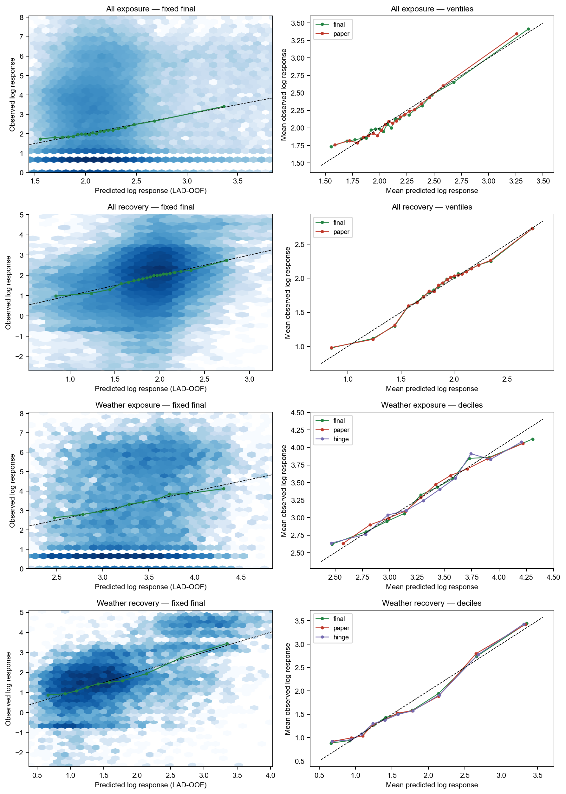
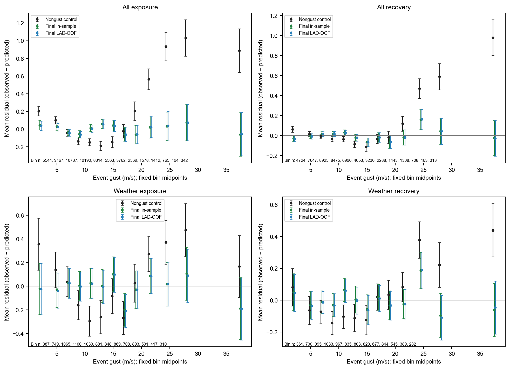
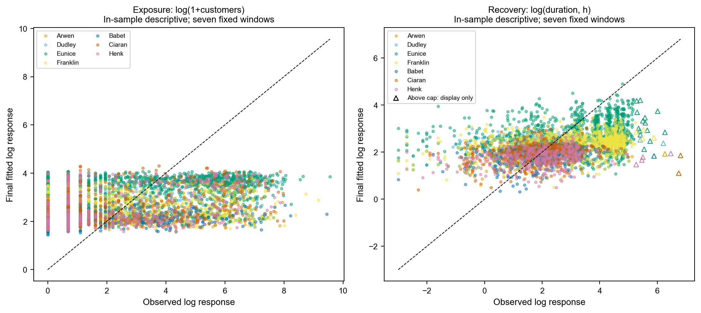
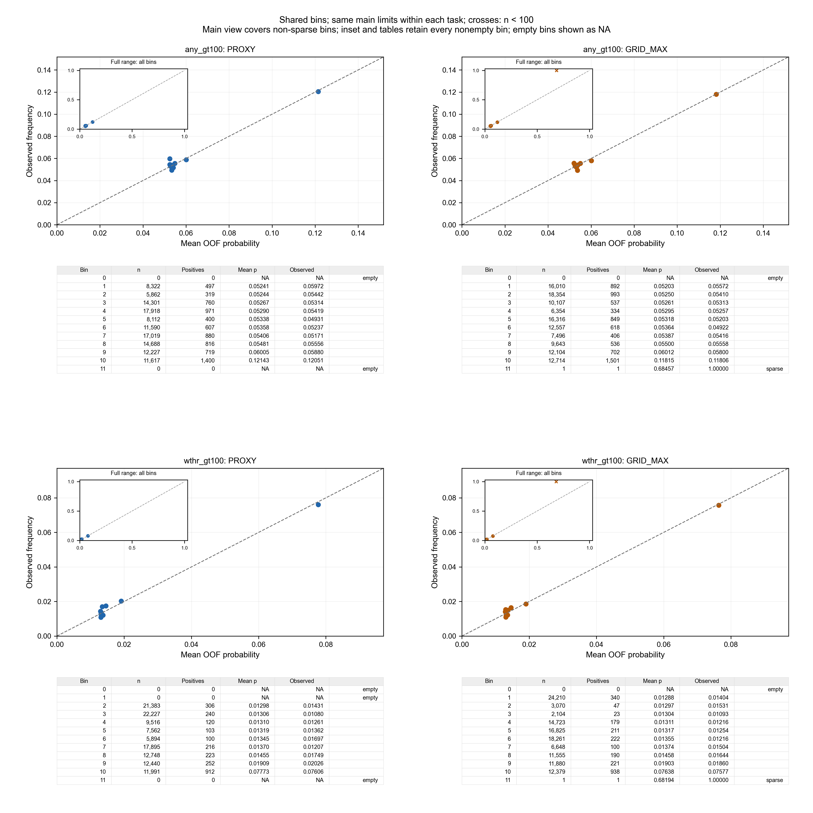
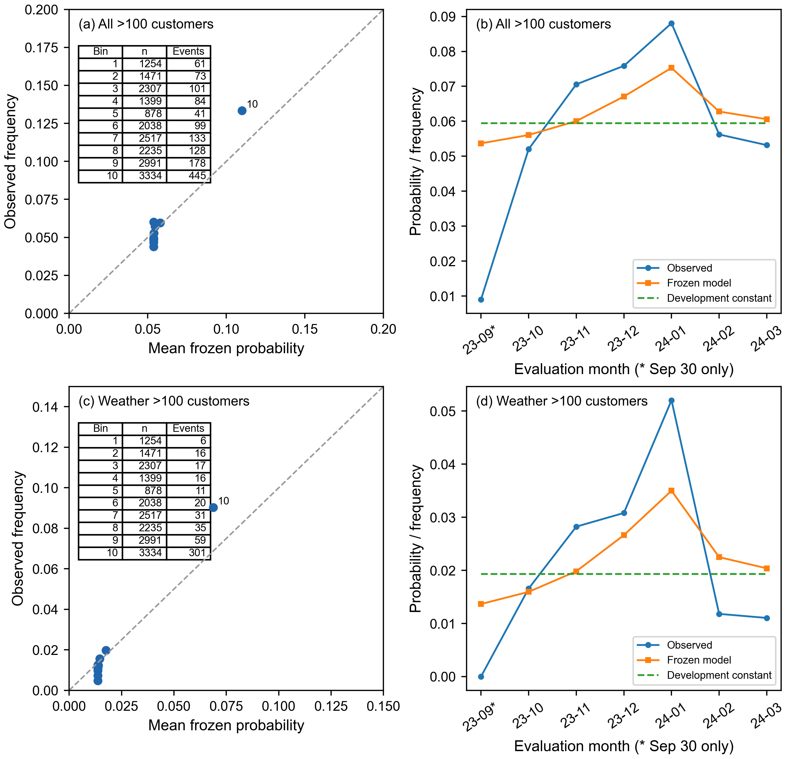

# Supplementary Information: Appendices F–J

## Appendix F. Coefficients, inference and incremental explanatory performance

### F.1 Final specifications and complete coefficients

The incident-level models describe two different outcomes: the extent of interruption, measured by the number of customers affected, and the duration of the reconstructed incident. Following Appendices A and B, let $C$ denote the reconstructed customer count and $D_B$ the incident span in hours. The fitted responses are $Y_E=\ln(1+C)$ and $Y_R=\ln D_B$. These are ordinary least-squares (OLS) regressions of transformed outcomes. They are distinct from the log-link models for raw outcomes considered in Appendix H.

The all-incident exposure sample contains 60,437 incidents, including zero-customer records. The recovery sample contains 51,173 incidents after the accepted positive-customer and duration cleaning rules. Their weather-attributed subsets contain 9,857 and 9,254 incidents, respectively. Here, “all-incident” refers to the cause groups included in the study, as defined in Appendix A; it does not mean every raw operational record.

All four specifications include precipitation, temperature, mean sea-level pressure, squared temperature, regional characteristics and year and month indicators. The regional terms are the urban indicator, log population, income deprivation rate, deprivation gap and Moran’s $I$. They are not a set of LAD fixed effects. The exposure models include a gust–pressure interaction. The recovery models instead include a gust–precipitation interaction and linear and squared standardised log customer count. Reference categories are the non-urban category, 2021 and January. The complete coefficients, including the intercept and all calendar terms, are given in Table F1.

For a continuous weather variable $v$, $z_v=(v-\bar v)/s_v$, with $s_v$ calculated using the sample standard deviation. Means and standard deviations refer to the estimation sample; in out-of-fold evaluation, they refer only to the training fold. Products and squares are formed after standardisation. The customer control is $z_C$, the standardised value of $\ln(1+C)$. Regional variables retain their recorded scales, specified in Appendix A. Gust $g$ is measured in m s$^{-1}$, precipitation $P$ in mm, temperature $T$ in °C and pressure $p$ in hPa.

The exposure models use the two plateau basis functions

\[
L(g;k_1)=\min(g,k_1),\qquad
R(g;k_1,k_2)=\min\{\max(g-k_1,0),k_2-k_1\}.
\tag{F.1}
\]

Their knots are fixed at 14 and 25 m s$^{-1}$ for all incidents and at 11 and 24 m s$^{-1}$ for weather-attributed incidents. The all-incident recovery model uses $z_g$ and $z_g^2$. The weather-attributed recovery model uses $z_g$ and the unstandardised hinge $(g-11)_+=\max(g-11,0)$, with the knot fixed at 11 m s$^{-1}$. Thus the two recovery specifications have different gust functions. Appendix C compares their established alternatives; Appendix D explains knot estimation and its uncertainty.

**Table F1. Complete coefficients of the four final OLS specifications.**

<!-- table:F1 start -->
**Table F1(a). All-incident exposure: $n=60,437$; reference $t_{110}$.**

| Term | Coefficient | SE: LAD | SE: two-way | 95% CI: LAD | 95% CI: two-way | Two-way $p$ |
| --- | --- | --- | --- | --- | --- | --- |
| Intercept | 3.363184 | 1.026703 | 1.028177 | [1.328499, 5.397869] | [1.325579, 5.400789] | 0.0014 |
| $z_P$ | 0.053438 | 0.010016 | 0.014612 | [0.033589, 0.073287] | [0.024480, 0.082395] | 0.0004 |
| $z_T$ | -0.034058 | 0.019368 | 0.028766 | [-0.072441, 0.004326] | [-0.091066, 0.022950] | 0.2390 |
| $z_p$ | -0.080631 | 0.010826 | 0.017651 | [-0.102084, -0.059177] | [-0.115612, -0.045650] | 1.29e-05 |
| $z_g z_p$ | -0.034934 | 0.007996 | 0.015771 | [-0.050780, -0.019088] | [-0.066188, -0.003679] | 0.0288 |
| Urban indicator | -0.149408 | 0.074468 | 0.074915 | [-0.296986, -0.001830] | [-0.297872, -0.000943] | 0.0486 |
| Log population | -0.072417 | 0.087264 | 0.087254 | [-0.245354, 0.100520] | [-0.245334, 0.100500] | 0.4084 |
| Income deprivation rate | -3.100220 | 0.887398 | 0.896782 | [-4.858835, -1.341606] | [-4.877432, -1.323009] | 0.0008 |
| Deprivation gap | 0.180419 | 0.538062 | 0.534933 | [-0.885894, 1.246731] | [-0.879692, 1.240530] | 0.7366 |
| Moran’s $I$ | -0.032088 | 0.236097 | 0.235001 | [-0.499978, 0.435801] | [-0.497806, 0.433629] | 0.8916 |
| Year 2022 | 0.075615 | 0.026436 | 0.032637 | [0.023225, 0.128006] | [0.010937, 0.140293] | 0.0224 |
| Year 2023 | 0.014684 | 0.030503 | 0.037635 | [-0.045766, 0.075134] | [-0.059899, 0.089267] | 0.6972 |
| Year 2024 | -0.022470 | 0.045849 | 0.066268 | [-0.113332, 0.068392] | [-0.153797, 0.108858] | 0.7352 |
| Month 2 | 0.086620 | 0.042740 | 0.069675 | [0.001921, 0.171320] | [-0.051459, 0.224700] | 0.2164 |
| Month 3 | 0.039420 | 0.048632 | 0.065609 | [-0.056958, 0.135798] | [-0.090601, 0.169441] | 0.5492 |
| Month 4 | -0.005972 | 0.048437 | 0.066201 | [-0.101963, 0.090019] | [-0.137167, 0.125223] | 0.9283 |
| Month 5 | 0.085492 | 0.053785 | 0.072529 | [-0.021097, 0.192080] | [-0.058243, 0.229226] | 0.2410 |
| Month 6 | 0.321378 | 0.058430 | 0.086142 | [0.205583, 0.437174] | [0.150665, 0.492092] | 0.0003 |
| Month 7 | 0.334115 | 0.056564 | 0.074877 | [0.222018, 0.446212] | [0.185726, 0.482504] | 1.97e-05 |
| Month 8 | 0.200103 | 0.055177 | 0.090408 | [0.090755, 0.309451] | [0.020936, 0.379270] | 0.0289 |
| Month 9 | 0.126836 | 0.054187 | 0.078207 | [0.019450, 0.234223] | [-0.028152, 0.281824] | 0.1077 |
| Month 10 | 0.052858 | 0.050420 | 0.067280 | [-0.047063, 0.152778] | [-0.080474, 0.186190] | 0.4338 |
| Month 11 | -0.046193 | 0.042793 | 0.063568 | [-0.130998, 0.038612] | [-0.172171, 0.079785] | 0.4690 |
| Month 12 | 0.105284 | 0.041326 | 0.058780 | [0.023386, 0.187182] | [-0.011204, 0.221772] | 0.0760 |
| $z_T^2$ | 0.056553 | 0.007898 | 0.022066 | [0.040901, 0.072205] | [0.012824, 0.100283] | 0.0117 |
| $L(g)$ | -0.026952 | 0.003019 | 0.004432 | [-0.032935, -0.020969] | [-0.035735, -0.018170] | 1.76e-08 |
| $R(g)$ | 0.121462 | 0.007162 | 0.013843 | [0.107267, 0.135656] | [0.094028, 0.148895] | 2.48e-14 |

**Table F1(b). All-incident recovery: $n=51,173$; reference $t_{110}$.**

| Term | Coefficient | SE: LAD | SE: two-way | 95% CI: LAD | 95% CI: two-way | Two-way $p$ |
| --- | --- | --- | --- | --- | --- | --- |
| Intercept | 0.662435 | 0.427593 | 0.433020 | [-0.184955, 1.509824] | [-0.195709, 1.520578] | 0.1289 |
| $z_g$ | -0.000245 | 0.008527 | 0.019205 | [-0.017144, 0.016654] | [-0.038305, 0.037814] | 0.9898 |
| $z_P$ | 0.046727 | 0.006885 | 0.009623 | [0.033082, 0.060372] | [0.027657, 0.065796] | 3.99e-06 |
| $z_T$ | -0.072372 | 0.009268 | 0.019050 | [-0.090740, -0.054005] | [-0.110125, -0.034620] | 0.0002 |
| $z_p$ | -0.041644 | 0.006989 | 0.012944 | [-0.055495, -0.027793] | [-0.067297, -0.015991] | 0.0017 |
| $z_g^2$ | 0.080963 | 0.004552 | 0.007414 | [0.071943, 0.089983] | [0.066271, 0.095656] | 3.00e-19 |
| Urban indicator | 0.217863 | 0.051911 | 0.052219 | [0.114987, 0.320739] | [0.114377, 0.321349] | 6.05e-05 |
| Log population | 0.066425 | 0.038287 | 0.038257 | [-0.009450, 0.142301] | [-0.009392, 0.142243] | 0.0853 |
| Income deprivation rate | 0.901666 | 0.684678 | 0.686438 | [-0.455204, 2.258537] | [-0.458693, 2.262026] | 0.1917 |
| Deprivation gap | -0.132306 | 0.500745 | 0.496474 | [-1.124664, 0.860052] | [-1.116200, 0.851589] | 0.7904 |
| Moran’s $I$ | 0.278452 | 0.157503 | 0.155466 | [-0.033682, 0.590587] | [-0.029645, 0.586550] | 0.0760 |
| Year 2022 | 0.102422 | 0.016302 | 0.023940 | [0.070115, 0.134728] | [0.054979, 0.149864] | 4.03e-05 |
| Year 2023 | 0.002904 | 0.017678 | 0.023979 | [-0.032130, 0.037937] | [-0.044617, 0.050424] | 0.9038 |
| Year 2024 | -0.077739 | 0.031268 | 0.067029 | [-0.139705, -0.015773] | [-0.210575, 0.055098] | 0.2487 |
| Month 2 | 0.444552 | 0.041786 | 0.109050 | [0.361742, 0.527362] | [0.228441, 0.660663] | 8.66e-05 |
| Month 3 | 0.043219 | 0.024920 | 0.036571 | [-0.006168, 0.092605] | [-0.029256, 0.115693] | 0.2398 |
| Month 4 | -0.009348 | 0.031187 | 0.042194 | [-0.071153, 0.052457] | [-0.092967, 0.074270] | 0.8251 |
| Month 5 | -0.008465 | 0.033540 | 0.048995 | [-0.074934, 0.058003] | [-0.105562, 0.088631] | 0.8631 |
| Month 6 | 0.138525 | 0.037466 | 0.054056 | [0.064276, 0.212774] | [0.031399, 0.245651] | 0.0117 |
| Month 7 | 0.124852 | 0.035167 | 0.050278 | [0.055160, 0.194544] | [0.025213, 0.224492] | 0.0145 |
| Month 8 | 0.139321 | 0.036457 | 0.051991 | [0.067072, 0.211571] | [0.036288, 0.242355] | 0.0085 |
| Month 9 | 0.074606 | 0.037866 | 0.050965 | [-0.000436, 0.149647] | [-0.026396, 0.175607] | 0.1461 |
| Month 10 | 0.030949 | 0.037844 | 0.051314 | [-0.044049, 0.105947] | [-0.070743, 0.132641] | 0.5477 |
| Month 11 | 0.011661 | 0.027284 | 0.045739 | [-0.042410, 0.065732] | [-0.078983, 0.102305] | 0.7992 |
| Month 12 | 0.057366 | 0.028947 | 0.044753 | [0.000000, 0.114731] | [-0.031325, 0.146056] | 0.2026 |
| $z_C$ | -0.196391 | 0.016463 | 0.017060 | [-0.229018, -0.163765] | [-0.230200, -0.162583] | 1.33e-20 |
| $z_C^2$ | -0.111330 | 0.013717 | 0.015500 | [-0.138514, -0.084146] | [-0.142048, -0.080612] | 8.60e-11 |
| $z_T^2$ | 0.016788 | 0.003826 | 0.005823 | [0.009206, 0.024369] | [0.005248, 0.028327] | 0.0047 |
| $z_g z_P$ | -0.024454 | 0.006304 | 0.009995 | [-0.036947, -0.011962] | [-0.044262, -0.004647] | 0.0160 |

**Table F1(c). Weather-attributed exposure: $n=9,857$; reference $t_{104}$.**

| Term | Coefficient | SE: LAD | SE: two-way | 95% CI: LAD | 95% CI: two-way | Two-way $p$ |
| --- | --- | --- | --- | --- | --- | --- |
| Intercept | 3.861680 | 1.468216 | 1.405679 | [0.950152, 6.773208] | [1.074165, 6.649194] | 0.0071 |
| $z_P$ | -0.118271 | 0.025769 | 0.034427 | [-0.169371, -0.067170] | [-0.186540, -0.050001] | 0.0009 |
| $z_T$ | 0.027199 | 0.039481 | 0.069033 | [-0.051094, 0.105492] | [-0.109696, 0.164094] | 0.6944 |
| $z_p$ | -0.185387 | 0.031044 | 0.040495 | [-0.246948, -0.123826] | [-0.265690, -0.105084] | 1.30e-05 |
| $z_g z_p$ | -0.086482 | 0.029686 | 0.033962 | [-0.145351, -0.027613] | [-0.153830, -0.019134] | 0.0123 |
| Urban indicator | -0.005810 | 0.064152 | 0.066456 | [-0.133026, 0.121406] | [-0.137595, 0.125974] | 0.9305 |
| Log population | -0.052849 | 0.123725 | 0.117871 | [-0.298200, 0.192502] | [-0.286592, 0.180894] | 0.6548 |
| Income deprivation rate | -1.948386 | 2.226160 | 2.183512 | [-6.362945, 2.466174] | [-6.278373, 2.381602] | 0.3743 |
| Deprivation gap | -1.385253 | 1.038705 | 0.997273 | [-3.445044, 0.674537] | [-3.362882, 0.592376] | 0.1678 |
| Moran’s $I$ | 0.590901 | 0.394930 | 0.378438 | [-0.192260, 1.374063] | [-0.159554, 1.341357] | 0.1215 |
| Year 2022 | 0.263404 | 0.082408 | 0.090317 | [0.099986, 0.426822] | [0.084303, 0.442505] | 0.0043 |
| Year 2023 | 0.388557 | 0.080329 | 0.091159 | [0.229262, 0.547851] | [0.207785, 0.569328] | 4.46e-05 |
| Year 2024 | 0.387142 | 0.149627 | 0.165241 | [0.090426, 0.683858] | [0.059464, 0.714821] | 0.0210 |
| Month 2 | -0.108025 | 0.110489 | 0.127846 | [-0.327129, 0.111079] | [-0.361547, 0.145498] | 0.4001 |
| Month 3 | 0.245740 | 0.138055 | 0.145329 | [-0.028028, 0.519508] | [-0.042452, 0.533932] | 0.0938 |
| Month 4 | 0.127679 | 0.190593 | 0.195327 | [-0.250274, 0.505633] | [-0.259662, 0.515021] | 0.5148 |
| Month 5 | 0.362029 | 0.172705 | 0.202057 | [0.019549, 0.704509] | [-0.038657, 0.762715] | 0.0761 |
| Month 6 | 1.018740 | 0.196097 | 0.239705 | [0.629873, 1.407608] | [0.543395, 1.494085] | 4.67e-05 |
| Month 7 | 0.782857 | 0.146348 | 0.202509 | [0.492643, 1.073070] | [0.381273, 1.184440] | 0.0002 |
| Month 8 | 0.770653 | 0.146130 | 0.198914 | [0.480872, 1.060435] | [0.376199, 1.165107] | 0.0002 |
| Month 9 | 0.436336 | 0.161240 | 0.210225 | [0.116590, 0.756082] | [0.019453, 0.853220] | 0.0404 |
| Month 10 | 0.554625 | 0.155132 | 0.204105 | [0.246992, 0.862258] | [0.149877, 0.959373] | 0.0077 |
| Month 11 | 0.275980 | 0.156277 | 0.182918 | [-0.033923, 0.585882] | [-0.086754, 0.638713] | 0.1344 |
| Month 12 | 0.559637 | 0.125049 | 0.147983 | [0.311660, 0.807615] | [0.266182, 0.853093] | 0.0003 |
| $L(g)$ | -0.059490 | 0.012007 | 0.015282 | [-0.083301, -0.035679] | [-0.089795, -0.029185] | 0.0002 |
| $R(g)$ | 0.078502 | 0.007611 | 0.009953 | [0.063410, 0.093594] | [0.058766, 0.098238] | 3.24e-12 |
| $z_T^2$ | 0.092837 | 0.013385 | 0.018885 | [0.066293, 0.119381] | [0.055388, 0.130286] | 3.31e-06 |

**Table F1(d). Weather-attributed recovery: $n=9,254$; reference $t_{103}$.**

| Term | Coefficient | SE: LAD | SE: two-way | 95% CI: LAD | 95% CI: two-way | Two-way $p$ |
| --- | --- | --- | --- | --- | --- | --- |
| Intercept | 2.603725 | 0.764108 | 0.776915 | [1.088298, 4.119152] | [1.062898, 4.144552] | 0.0011 |
| $z_g$ | -0.054476 | 0.043179 | 0.088973 | [-0.140111, 0.031159] | [-0.230932, 0.121980] | 0.5417 |
| $z_P$ | 0.060400 | 0.017755 | 0.023403 | [0.025186, 0.095613] | [0.013986, 0.106813] | 0.0113 |
| $z_T$ | -0.133726 | 0.028381 | 0.063410 | [-0.190012, -0.077440] | [-0.259485, -0.007967] | 0.0374 |
| $z_p$ | -0.101701 | 0.022999 | 0.033694 | [-0.147314, -0.056087] | [-0.168526, -0.034875] | 0.0032 |
| Urban indicator | 0.002786 | 0.055832 | 0.050932 | [-0.107944, 0.113516] | [-0.098225, 0.103797] | 0.9565 |
| Log population | -0.138079 | 0.063518 | 0.062784 | [-0.264052, -0.012106] | [-0.262596, -0.013563] | 0.0301 |
| Income deprivation rate | -4.124683 | 1.255500 | 1.252248 | [-6.614670, -1.634695] | [-6.608221, -1.641144] | 0.0014 |
| Deprivation gap | 1.348822 | 0.562941 | 0.517977 | [0.232361, 2.465284] | [0.321537, 2.376107] | 0.0106 |
| Moran’s $I$ | 0.113110 | 0.271707 | 0.249043 | [-0.425758, 0.651977] | [-0.380808, 0.607027] | 0.6507 |
| Year 2022 | 0.259161 | 0.033273 | 0.047164 | [0.193173, 0.325150] | [0.165623, 0.352700] | 2.84e-07 |
| Year 2023 | 0.107571 | 0.040490 | 0.049967 | [0.027270, 0.187873] | [0.008473, 0.206670] | 0.0337 |
| Year 2024 | -0.153955 | 0.088167 | 0.148566 | [-0.328813, 0.020904] | [-0.448599, 0.140690] | 0.3025 |
| Month 2 | 0.758979 | 0.075170 | 0.165536 | [0.609898, 0.908061] | [0.430677, 1.087282] | 1.28e-05 |
| Month 3 | -0.350555 | 0.085087 | 0.132553 | [-0.519306, -0.181804] | [-0.613443, -0.087667] | 0.0095 |
| Month 4 | -0.306575 | 0.094300 | 0.140738 | [-0.493597, -0.119554] | [-0.585697, -0.027454] | 0.0317 |
| Month 5 | -0.212186 | 0.102266 | 0.157608 | [-0.415007, -0.009365] | [-0.524764, 0.100392] | 0.1812 |
| Month 6 | 0.143789 | 0.100269 | 0.167396 | [-0.055071, 0.342649] | [-0.188201, 0.475779] | 0.3923 |
| Month 7 | 0.099068 | 0.099303 | 0.163368 | [-0.097875, 0.296012] | [-0.224933, 0.423070] | 0.5456 |
| Month 8 | 0.114356 | 0.097071 | 0.167171 | [-0.078161, 0.306872] | [-0.217188, 0.445899] | 0.4955 |
| Month 9 | 0.004686 | 0.109068 | 0.170531 | [-0.211625, 0.220996] | [-0.333522, 0.342893] | 0.9781 |
| Month 10 | -0.072800 | 0.108682 | 0.167592 | [-0.288346, 0.142746] | [-0.405178, 0.259578] | 0.6649 |
| Month 11 | -0.259993 | 0.101653 | 0.147636 | [-0.461597, -0.058390] | [-0.552795, 0.032808] | 0.0812 |
| Month 12 | -0.296226 | 0.090993 | 0.138695 | [-0.476689, -0.115763] | [-0.571296, -0.021156] | 0.0351 |
| $z_C$ | -0.294811 | 0.019175 | 0.030600 | [-0.332840, -0.256782] | [-0.355500, -0.234122] | 4.82e-16 |
| $z_C^2$ | 0.092286 | 0.024900 | 0.027616 | [0.042902, 0.141670] | [0.037515, 0.147056] | 0.0012 |
| $(g-11)_+$ | 0.069595 | 0.007933 | 0.018529 | [0.053862, 0.085328] | [0.032846, 0.106343] | 0.0003 |
| $z_T^2$ | 0.064135 | 0.007675 | 0.015253 | [0.048914, 0.079355] | [0.033884, 0.094386] | 5.59e-05 |
| $z_g z_P$ | -0.056232 | 0.013013 | 0.021898 | [-0.082041, -0.030422] | [-0.099661, -0.012802] | 0.0117 |
<!-- table:F1 end -->

*Notes:* The responses are $Y_E=\ln(1+C)$ and $Y_R=\ln D_B$; the observational unit is an incident. LAD denotes local authority district. “Two-way” denotes simultaneous clustering by LAD and incident date, not clustering solely by their intersection. Each panel reports the same coefficient estimates under both covariance estimators. All intervals are two-sided 95% intervals; the final column uses the two-way covariance and the indicated Student reference distribution. A month number denotes that calendar month relative to January. $L(g)$ and $R(g)$ use the panel-specific knots in Eq. (F.1). Raw-gust basis coefficients and standardised-variable coefficients have different units. A small rounded coefficient is not an omitted term.

### F.2 District and two-way clustered inference

Incidents within one LAD can share regional conditions, while incidents on one date can share weather across LAD boundaries. The two covariance estimators address these two sources of dependence without changing the fitted conditional mean. The two-way covariance is the sum of the LAD and date cluster covariances minus the covariance for LAD–date intersections, following the multiway clustering construction of Cameron, Gelbach and Miller [29]. Each component uses the finite-sample factor $G/(G-1)\,(n-1)/(n-k)$, where $G$ is the number of groups in that component and $k$ is the design rank.

Coefficient intervals and two-sided tests use $t_{G_{\mathrm{LAD}}-1}$. The all-incident models have 111 LAD clusters and hence 110 degrees of freedom. Weather-attributed exposure has 105 LAD clusters, 1,001 dates and 6,122 LAD–date intersections; weather-attributed recovery has 104 LAD clusters, 995 dates and 5,870 intersections. Their reference degrees of freedom are therefore 104 and 103, rather than 110. The corresponding design ranks are 27 and 29.

Table F3 isolates the weather models’ gust terms to show the size of the change in uncertainty. For exposure, two-way SEs are approximately 1.27 times the LAD-only SE for the low-gust basis, 1.31 times for the ramp and 1.14 times for gust–pressure. For recovery, the ratios are approximately 2.06 for the linear standardised gust term, 2.34 for the hinge and 1.68 for gust–precipitation. The change is therefore term-specific. Across all coefficients, the ratios range from 0.953 to 1.748 for weather exposure and from 0.912 to 2.336 for weather recovery; some SEs become smaller.

**Table F3. Weather-attributed final models: change in gust-term standard errors when date clustering is added.**

<!-- table:F3 start -->
| Sample | Term | LAD SE | Two-way SE | SE ratio |
| --- | --- | --- | --- | --- |
| Weather-attributed exposure | $z_g z_p$ | 0.029686 | 0.033962 | 1.1440 |
| Weather-attributed exposure | $L(g)$ | 0.012007 | 0.015282 | 1.2727 |
| Weather-attributed exposure | $R(g)$ | 0.007611 | 0.009953 | 1.3077 |
| Weather-attributed recovery | $z_g$ | 0.043179 | 0.088973 | 2.0606 |
| Weather-attributed recovery | $(g-11)_+$ | 0.007933 | 0.018529 | 2.3357 |
| Weather-attributed recovery | $z_g z_P$ | 0.013013 | 0.021898 | 1.6827 |
<!-- table:F3 end -->

*Notes:* The ratio is two-way SE divided by LAD-only SE. Sample sizes, coefficients and design columns are identical within each comparison. Full coefficient intervals, including calendar and regional terms, appear in Table F1(c,d). The table describes covariance sensitivity, not a comparison of different mean models.

For these weather models, the gust terms retain the same interval-exclusion conclusions under the two covariance choices. Calendar terms are less uniform: May in the exposure model and May and November in the recovery model change whether their 95% intervals include zero. The weather-exposure two-way covariance has a small negative eigenvalue (approximately $-9.42\times10^{-6}$), although all reported coefficient variances are positive. The displayed marginal intervals use the recorded covariance without a positive-semidefinite adjustment; they do not establish the validity of every possible joint contrast. The weather-recovery covariance is positive definite. This distinction concerns covariance inference, not a change in the point estimates.

### F.3 Incremental out-of-fold explanatory performance

To describe how the established predictor blocks contribute in sequence, the sequential analysis pools predictions from five LAD-held-out folds. Every incident receives a prediction from a model trained without its LAD. For a given analysis sample, the pooled coefficient of determination is

\[
R^2_{\mathrm{OOF}}=1-
\frac{\sum_i(Y_i-\widehat Y_{i,-\mathrm{LAD}})^2}
{\sum_i(Y_i-\bar Y)^2},
\tag{F.2}
\]

where $\bar Y$ is the mean transformed response in that evaluation sample. Thus the denominator is the pooled sample’s total sum of squares, not the mean of fold-specific denominators. The folds are fixed across successive blocks within a sample. Regional and calendar predictors enter together, followed by non-gust weather, then all gust-related terms, including gust interactions. Recovery adds the customer-size terms last. Table F2 reports the cumulative value and its change from the preceding block.

**Table F2. Sequential LAD-out-of-fold explanatory performance under the recorded block order.**

<!-- table:F2 start -->
| Sample | Response | Added block | Cumulative OOF $R^2$ | Sequential increment |
| --- | --- | --- | --- | --- |
| All | Exposure | Regional + calendar | 0.009594 | 0.009594 |
| All | Exposure | Non-gust weather | 0.018710 | 0.009115 |
| All | Exposure | Gust | 0.033574 | 0.014865 |
| All | Recovery | Regional + calendar | 0.034649 | 0.034649 |
| All | Recovery | Non-gust weather | 0.040734 | 0.006085 |
| All | Recovery | Gust | 0.047756 | 0.007022 |
| All | Recovery | Affected customers | 0.107446 | 0.059691 |
| Weather | Exposure | Regional + calendar | 0.007840 | 0.007840 |
| Weather | Exposure | Non-gust weather | 0.028658 | 0.020818 |
| Weather | Exposure | Gust | 0.044280 | 0.015622 |
| Weather | Recovery | Regional + calendar | 0.201767 | 0.201767 |
| Weather | Recovery | Non-gust weather | 0.227046 | 0.025279 |
| Weather | Recovery | Gust | 0.245819 | 0.018773 |
| Weather | Recovery | Affected customers | 0.281245 | 0.035426 |
<!-- table:F2 end -->

*Notes:* Exposure and recovery use $\ln(1+C)$ and $\ln D_B$, respectively. The all-incident sample sizes are 60,437 and 51,173; the weather-attributed sample sizes are 9,857 and 9,254. The first increment is relative to zero in Eq. (F.2). “Regional + calendar” is a joint block and cannot be attributed entirely to calendar effects. Non-gust weather includes precipitation, temperature, pressure and squared temperature. The gust block includes the corresponding interactions. Recovery’s final block contains $z_C$ and $z_C^2$. The sequential analysis uses the all-incident gust design in both cause-group samples: the 14/25 exposure plateau and quadratic recovery function. Its weather rows therefore do not decompose the 11/24 exposure and single-knot recovery models in Table F1(c,d). The latter models’ prediction metrics are reported separately in Appendix G.

In the all-incident exposure sample, adding gust raises OOF $R^2$ from 0.018710 to 0.033574. In recovery, the corresponding change is from 0.040734 to 0.047756, followed by an increase to 0.107446 after customer size is added. The weather-sample analysis yields larger cumulative recovery values, but it describes a different sample and cannot be interpreted as an improvement on the same prediction task. Its final recovery value, 0.281245, also pertains to the sequential quadratic specification identified in the table note.

These increments quantify additional explanatory performance conditional on the predictors already entered. Correlation between blocks makes them order-dependent. They are neither a unique allocation of explained variation nor a decomposition of causal contributions. In particular, customer size is known from the realised incident and contributes to a conditional description of recovery.

### F.4 Interpretation of transformed outcomes and interaction terms

A change in a fitted exposure value is a change in expected $\ln(1+C)$, not an additive number of customers. Likewise, a recovery coefficient concerns expected log incident span, not an additive number of hours. Exponentiating fitted log values alone does not generally recover the arithmetic conditional mean of the original outcome. This is why Appendix H examines raw-outcome mean models separately.

The plateau coefficients multiply basis functions expressed in m s$^{-1}$. Below $k_1$, the gust-only slope is the coefficient of $L(g)$; between $k_1$ and $k_2$, it is the coefficient of $R(g)$; above $k_2$, that component is constant. The gust–pressure interaction adds $b_{gp}z_p/s_g$ to the slope. Consequently, a plateau in the main gust component does not imply a flat total conditional response at every pressure value.

For all-incident recovery, the total gust slope on the log-duration scale is

\[
\frac{\partial\widehat Y_R}{\partial g}
=\frac{b_g+2b_{g^2}z_g+b_{gP}z_P}{s_g}.
\tag{F.3}
\]

For weather-attributed recovery it is $(b_g+b_{gP}z_P)/s_g+b_h\mathbf{1}(g>11)$, apart from the derivative at the knot itself. The hinge coefficient is a slope increment, whereas the linear standardised gust coefficient must be divided by $s_g$ to obtain a slope per m s$^{-1}$. These distinctions prevent a squared term, hinge increment or interaction coefficient from being read as a complete gust effect by itself.

## Appendix G. Incident-level prediction and residual diagnostics

### G.1 Predictions, samples and validation identity

The diagnostics in this appendix use the four final samples and fixed specifications in Appendix F. They distinguish fitted values obtained from all observations in an analysis sample from LAD out-of-fold (LAD-OOF) predictions. The latter use five fixed folds, with standardisation and OLS coefficients estimated within each training fold. The established knots remain fixed. This evaluation therefore differs from the training-fold knot selection examined in Appendices C and D; its error values should not be substituted for nested-CV results.

Table G4 reports pooled incident-weighted RMSE, mean absolute error (MAE), mean prediction, bias, $R^2$ and correlation. Bias is defined as mean prediction minus mean observation; residuals in Section G.3 use the opposite sign, observation minus prediction. RMSE and MAE are calculated on the fitted log-response scales. Both a small mean bias and substantial individual prediction error can occur in the same model.

<!-- table:G4 start -->
**Table G4(a). Final specifications.**

| Combination | Model / predictions | $n$ | RMSE | MAE | Mean prediction | Bias | $R^2$ | Correlation |
| --- | --- | --- | --- | --- | --- | --- | --- | --- |
| All-incident exposure | final / in sample | 60,437 | 1.980613 | 1.684259 | 2.138423 | 0.000000 | 0.037605 | 0.193921 |
| All-incident exposure | final / LAD OOF | 60,437 | 1.984757 | 1.688260 | 2.143528 | 0.005105 | 0.033574 | 0.183632 |
| Weather-attributed exposure | final / in sample | 9,857 | 2.155826 | 1.880197 | 3.356291 | -0.000000 | 0.054982 | 0.234482 |
| Weather-attributed exposure | final / LAD OOF | 9,857 | 2.166862 | 1.889186 | 3.361077 | 0.004786 | 0.045282 | 0.214317 |
| All-incident recovery | final / in sample | 51,173 | 1.146773 | 0.870790 | 1.867916 | 0.000000 | 0.112839 | 0.335914 |
| All-incident recovery | final / LAD OOF | 51,173 | 1.150253 | 0.873793 | 1.869561 | 0.001645 | 0.107446 | 0.327941 |
| Weather-attributed recovery | final / in sample | 9,254 | 1.236094 | 0.952704 | 1.680763 | 0.000000 | 0.294451 | 0.542633 |
| Weather-attributed recovery | final / LAD OOF | 9,254 | 1.245921 | 0.959638 | 1.684049 | 0.003285 | 0.283189 | 0.532272 |

**Table G4(b). Existing comparison specifications, LAD-OOF only.**

| Combination | Model / predictions | $n$ | RMSE | MAE | Mean prediction | Bias | $R^2$ | Correlation |
| --- | --- | --- | --- | --- | --- | --- | --- | --- |
| All-incident exposure | paper / LAD OOF | 60,437 | 1.988682 | 1.692504 | 2.143991 | 0.005568 | 0.029748 | 0.173045 |
| Weather-attributed exposure | paper / LAD OOF | 9,857 | 2.178407 | 1.902075 | 3.361430 | 0.005139 | 0.035081 | 0.189617 |
| Weather-attributed exposure | hinge / LAD OOF | 9,857 | 2.171394 | 1.893738 | 3.361593 | 0.005302 | 0.041284 | 0.204928 |
| All-incident recovery | paper / LAD OOF | 51,173 | 1.150573 | 0.873864 | 1.869554 | 0.001639 | 0.106949 | 0.327181 |
| Weather-attributed recovery | paper / LAD OOF | 9,254 | 1.250446 | 0.963253 | 1.684420 | 0.003656 | 0.277972 | 0.527327 |
| Weather-attributed recovery | hinge / LAD OOF | 9,254 | 1.249666 | 0.964027 | 1.684654 | 0.003890 | 0.278873 | 0.528184 |
<!-- table:G4 end -->

*Notes:* Exposure uses $\ln(1+C)$; recovery uses $\ln D_B$ in hours. “In sample” denotes full-sample OLS fitted values. LAD-OOF denotes held-out districts with fixed knots and training-fold preprocessing. The comparison labelled “paper” is the established quadratic specification, evaluated on the same current sample as the corresponding final model. The weather “hinge” comparator is the existing segmented specification before the final control changes: it lacks squared temperature and, for recovery, retains gust–pressure instead of the final gust–precipitation interaction. These are finite specification comparisons, not pure substitutions of a gust function under identical controls; Appendix C provides the controlled function comparisons. All $R^2$ values use the pooled denominator in Eq. (F.2). No original-scale retransformation is applied.

For the final all-incident models, LAD-OOF RMSE is 1.984757 for exposure and 1.150253 for recovery, with $R^2$ of 0.033574 and 0.107446. Weather-attributed values are 2.166862 and 1.245921, with $R^2$ of 0.045282 and 0.283189. The difference between full-sample and LAD-OOF performance is modest within these fixed specifications. The larger weather-recovery $R^2$ does not show that restricting the sample improves prediction for an unchanged population: both the response distribution and the conditioning population differ.

### G.2 Predicted versus observed outcomes and binned calibration

Figure G2 separates the spread of individual outcomes from agreement between group means. Its left panels compare individual LAD-OOF predictions with observed transformed outcomes. The broad vertical spread indicates that incidents with similar predicted values can have substantially different realised severity or duration. The right panels aggregate predictions into quantile groups: 20 for the all-incident models and 10 for the weather-attributed models, merging duplicate boundaries. Each specification is binned by its own predictions; the plotted group means are not necessarily based on identical incident memberships across specifications.

**Figure G2. Individual prediction dispersion and binned mean agreement for the four current analysis samples.** Rows show all-incident exposure, all-incident recovery, weather-attributed exposure and weather-attributed recovery. In the left panels, the horizontal axis is the final model’s LAD-OOF prediction and the vertical axis is the observed transformed response; hexagonal shading shows observation density and green points show binned means. Right panels compare the final model (green), the established quadratic comparator labelled “paper” (red), and, for weather-attributed samples, the existing segmented comparator labelled “hinge” (purple). Samples and comparator definitions are those in Table G4. The dashed diagonal denotes agreement of mean prediction and observation. These panels show means without clustered confidence bands; connected means summarise bins rather than individual prediction intervals.

The final models have small pooled LAD-OOF biases: 0.005105 and 0.001645 for all-incident exposure and recovery, and 0.004786 and 0.003285 for their weather-attributed counterparts. These averages do not imply close agreement at every predicted value. Departures from the diagonal remain in the binned curves, while individual errors are much larger than the pooled mean biases.

The shortest observed recovery records provide a specific example. Among incidents with observed $D_B\leq1$ h, mean LAD-OOF prediction minus observation is 2.449839 log-hours for all incidents ($n=3,775$) and 2.148718 log-hours for weather-attributed incidents ($n=1,083$). These are descriptions of groups selected by their observed duration, not prospective groups defined before observing recovery. They show that the positive-customer cleaning rule does not remove the short-duration prediction discrepancy. The discrepancy alone does not identify its operational cause.

### G.3 Residual patterns across gust bands

Gust-band diagnostics ask whether departures from the fitted conditional mean vary systematically with the observed gust input. Figure G1 distinguishes three quantities: residuals from the no-gust control model, residuals from the final full-sample fit, and residuals from the final LAD-OOF predictions. The no-gust model retains the non-gust controls; it is a reference for the pattern remaining before gust terms are included, rather than an alternative definition of the final residual.

The fixed right-closed gust bands have boundaries 0, 4, 6, 8, 10, 12, 14, 16, 18, 20, 23, 26, 30 and 45 m s$^{-1}$. Each point is the within-band mean residual, with a descriptive interval of $\bar e\pm1.96\,s_e/\sqrt{n_b}$, where $n_b$ is the number of incidents in the band. These intervals do not adjust for LAD or date dependence and are not the two-way confidence bands of a fitted response curve.

**Figure G1. Residual means across gust bands for the four final analysis samples.** The panels identify the all-incident and weather-attributed exposure and recovery samples. Residuals are observed minus predicted $\ln(1+C)$ or $\ln D_B$. Black points represent the no-gust control fit, green points the final in-sample fit, and blue points final LAD-OOF predictions. The horizontal coordinate is the band midpoint; small offsets distinguish overlapping series. Counts printed within each panel give band support. Error bars are the unclustered mean-residual intervals defined above. The horizontal zero line denotes mean agreement, not an interval for an individual incident.

Adding the final gust specification reduces the prominent gust-related residual pattern of the no-gust reference, but does not produce zero mean residuals in every band. Across these bands, final LAD-OOF residual means range from approximately −0.0616 to 0.0753 for all-incident exposure and −0.0659 to 0.1639 for recovery. Weather-attributed ranges are −0.2097 to 0.0984 and −0.1095 to 0.1909. Band counts and error bars are therefore relevant when comparing local deviations. The diagnostics support a distinction between capturing part of a gust-related mean pattern and accurately predicting each incident.

## Appendix H. Alternative outcome models and incident-conditional exceedance

### H.1 Sensitivity to outcome distribution and mean specification

The transformed-response OLS models are useful for describing associations across a wide range of incident sizes, but they do not directly estimate the arithmetic conditional mean of customer count or duration. Four alternative models examine that distinction on the accepted all-incident samples (Table H7). Exposure is fitted with negative binomial type 2 (NB2) and Tweedie models; recovery is fitted with Gamma and Tweedie models. Each uses the corresponding final design matrix from Appendix F, with an explicit log mean, $\ln\mu_i=X_i b$, for the raw outcome. Exposure retains all 60,437 observations, including 8,979 zero customer counts. Recovery uses the 51,173 positive-customer, cleaned positive-duration observations.

**Table H7. Raw-outcome mean models and their fixed design.**

| Outcome and sample | Family and mean link | Variance specification | Estimated dispersion | Fixed predictors |
| --- | --- | --- | --- | --- |
| Customer count, all incidents; $n=60,437$ | NB2, $\ln\mu=Xb$ | $\mu+\alpha\mu^2$ | $\alpha=4.703206959$ | Exposure 14/25 plateau, squared temperature, gust–pressure and the other exposure controls in Table F1(a) |
| Customer count, all incidents; $n=60,437$ | Tweedie, $\ln\mu=Xb$ | $\phi\mu^{1.5}$ | $\phi=211.2479653$ | Same exposure design |
| Incident span in hours, all incidents; $n=51,173$ | Gamma, $\ln\mu=Xb$ | $\phi\mu^2$ | $\phi=1.978554568$ | Quadratic gust, squared temperature, gust–precipitation and the other recovery controls in Table F1(b) |
| Incident span in hours, all incidents; $n=51,173$ | Tweedie, $\ln\mu=Xb$ | $\phi\mu^{1.5}$ | $\phi=6.405663818$ | Same recovery design |

*Notes:* NB2 jointly estimates regression coefficients and dispersion by maximum likelihood. Gamma and Tweedie use the fitted Pearson scale; the Tweedie variance power is fixed at 1.5 and estimation uses the extended quasi-likelihood setting. No weather-subset GLMs are represented in this comparison. The OLS reference targets $E[\ln(1+C)\mid X]$ or $E[\ln D_B\mid X]$, whereas these models target the raw-outcome mean $\mu=E[C\mid X]$ or $E[D_B\mid X]$. Their coefficient magnitudes, likelihood criteria and response-scale errors are not a common-scale ranking.

Inference uses the same LAD/date two-way clustering principle as Section F.2, with 111 LAD clusters and a $t_{110}$ reference. For NB2, the likelihood score, Hessian and finite-sample parameter count include jointly estimated dispersion. For Gamma and Tweedie, the covariance uses the coefficient score and fitted Pearson scale; scale is not treated as an additional jointly estimated parameter. Table H6 retains every comparison of the three key gust-related terms in each outcome, including the exception in recovery’s linear term.

**Table H6. Key gust-basis and interaction coefficients under transformed OLS and raw-outcome mean models.**

<!-- table:H6 start -->
**All-incident exposure.**

| Alternative | Term | OLS coefficient | OLS 95% CI | Alternative coefficient | Alternative 95% CI | Alternative $p$ |
| --- | --- | --- | --- | --- | --- | --- |
| NB2 | $z_g z_p$ | -0.034934 | [-0.066188, -0.003679] | -0.045645 | [-0.081363, -0.009928] | 0.0127 |
| NB2 | $L(g)$ | -0.026952 | [-0.035735, -0.018170] | -0.039297 | [-0.054277, -0.024317] | 9.34e-07 |
| NB2 | $R(g)$ | 0.121462 | [0.094028, 0.148895] | 0.075628 | [0.044580, 0.106676] | 4.49e-06 |
| Tweedie | $z_g z_p$ | -0.034934 | [-0.066188, -0.003679] | -0.041096 | [-0.071768, -0.010424] | 0.0091 |
| Tweedie | $L(g)$ | -0.026952 | [-0.035735, -0.018170] | -0.040365 | [-0.055770, -0.024960] | 9.59e-07 |
| Tweedie | $R(g)$ | 0.121462 | [0.094028, 0.148895] | 0.078240 | [0.049049, 0.107431] | 5.72e-07 |

**All-incident recovery.**

| Alternative | Term | OLS coefficient | OLS 95% CI | Alternative coefficient | Alternative 95% CI | Alternative $p$ |
| --- | --- | --- | --- | --- | --- | --- |
| Gamma | $z_g$ | -0.000245 | [-0.038305, 0.037814] | 0.018840 | [-0.019589, 0.057270] | 0.3334 |
| Gamma | $z_g^2$ | 0.080963 | [0.066271, 0.095656] | 0.064548 | [0.046933, 0.082164] | 5.79e-11 |
| Gamma | $z_g z_P$ | -0.024454 | [-0.044262, -0.004647] | -0.025411 | [-0.045747, -0.005075] | 0.0148 |
| Tweedie | $z_g$ | -0.000245 | [-0.038305, 0.037814] | 0.034318 | [-0.017027, 0.085662] | 0.1881 |
| Tweedie | $z_g^2$ | 0.080963 | [0.066271, 0.095656] | 0.058842 | [0.033940, 0.083745] | 8.13e-06 |
| Tweedie | $z_g z_P$ | -0.024454 | [-0.044262, -0.004647] | -0.024838 | [-0.047726, -0.001950] | 0.0337 |
<!-- table:H6 end -->

*Notes:* All intervals are 95% LAD/date two-way intervals using $t_{110}$. The OLS estimates repeat within a response to make each alternative comparison readable. Exposure’s $L(g)$ and $R(g)$ are the fixed 14/25 basis functions. Recovery includes the standardised linear and squared gust terms. The same design columns do not make the two kinds of conditional mean numerically equivalent.

For exposure, the low-gust, ramp and gust–pressure terms retain their directions and exclude zero in all three models. For recovery, the squared gust term remains positive and gust–precipitation remains negative, with their intervals excluding zero. The linear gust coefficient changes from −0.000245 in OLS to 0.018840 in Gamma and 0.034318 in Tweedie, but all three intervals include zero. Thus ten of the twelve alternative-versus-OLS term comparisons retain the coefficient sign, while all twelve retain whether the reported 95% interval excludes zero. The recovery exception does not establish an opposing total gust response, because that response also depends on the square and interaction terms.

This sensitivity comparison shows which term-level associations persist under different outcome means and variance assumptions. Because the exposure plateau basis and its knots are held fixed, it does not independently establish that a plateau is the best gust function or that its knots are optimally located. Those are the distinct comparisons in Appendices C and D.

### H.2 Existing ordinal severity models

Severity categories provide a complementary description when distinctions between classes are more useful than a change in a transformed continuous response. The existing ordered-logit analysis uses five customer-count categories and four duration categories, shown in Table H1. Exposure uses 60,437 incidents. The recovery analysis is historical and uses 59,834 records, including records excluded from the final positive-customer recovery sample; it is not a second fit on the current 51,173 incidents.

**Table H1. Categories and sample composition in the existing ordinal analyses.**

<!-- table:H1 start -->
| Analysis | Category | $n$ | Share (%) | Knots (m s$^{-1}$) |
| --- | --- | --- | --- | --- |
| Exposure | 0 | 60,437 | 14.8568 | [14.0, 26.0] |
| Exposure | 1–5 | 60,437 | 42.8231 | [14.0, 26.0] |
| Exposure | 6–100 | 60,437 | 27.5841 | [14.0, 26.0] |
| Exposure | 101–1000 | 60,437 | 12.8828 | [14.0, 26.0] |
| Exposure | >1000 | 60,437 | 1.8532 | [14.0, 26.0] |
| Historical recovery | $(0,3]$ h | 59,834 | 31.4938 | [17.0] |
| Historical recovery | $(3,12]$ h | 59,834 | 42.1951 | [17.0] |
| Historical recovery | $(12,48]$ h | 59,834 | 22.0945 | [17.0] |
| Historical recovery | >48 h | 59,834 | 4.2167 | [17.0] |
<!-- table:H1 end -->

*Notes:* Exposure categories are integer customer counts. Recovery categories have the displayed right-closed endpoints; a duration of exactly 3 h belongs to the first category and exactly 12 h to the second. Shares are percentages of each analysis sample, not of all operational records. Exposure uses a free two-knot segmented gust function with knots at 14 and 26 m s$^{-1}$; historical recovery uses a single knot at 17 m s$^{-1}$. These are not the fixed final plateau and recovery functions in Appendix F.

The ordered model uses a common slope vector across cumulative category logits, with category-specific cutpoints. Separate binary cumulative logits provide the existing descriptive comparison. Both use the established regional, calendar and weather controls; the historical recovery design also includes customer size. The gust specification replaces the quadratic gust term with the indicated hinges and does not include the final specification’s added squared-temperature term. Table H2 reports gust coefficients; interpretation is restricted to these contrasts rather than complete category-probability curves.

**Table H2. Gust coefficients from ordered and separate cumulative binary logits.**

<!-- table:H2 start -->
| Analysis | Model | $z_g$ coefficient | First raw-gust hinge | Second raw-gust hinge |
| --- | --- | --- | --- | --- |
| Exposure | Ordered logit | -0.130586 | 0.130018 | -0.134128 |
| Exposure | Binary: C>0 | -0.047342 | 0.123579 | -0.138061 |
| Exposure | Binary: C>5 | -0.150452 | 0.129105 | -0.127003 |
| Exposure | Binary: C>100 | -0.171787 | 0.140913 | -0.189739 |
| Exposure | Binary: C>1000 | -0.276725 | 0.113319 | -0.103158 |
| Historical recovery | Ordered logit | -0.046275 | 0.180140 | — |
| Historical recovery | Binary: duration>3 h | -0.024705 | 0.110182 | — |
| Historical recovery | Binary: duration>12 h | -0.094856 | 0.178819 | — |
| Historical recovery | Binary: duration>48 h | 0.126991 | 0.145040 | — |
<!-- table:H2 end -->

*Notes:* The first hinge is $(g-14)_+$ for exposure and $(g-17)_+$ for historical recovery; the exposure second hinge is $(g-26)_+$. The linear term uses standardised gust, while hinges use raw gust units. Each binary model contrasts outcomes strictly above the indicated threshold with those at or below it. Entries are coefficient estimates; this table does not supply confidence intervals or a formal test of the proportional-odds restriction. Samples are those of Table H1.

The separate threshold coefficients are not identical. For example, the historical recovery linear gust coefficient is negative for exceedance of 3 and 12 h but positive for exceedance of 48 h. Such differences explain why a single common slope is a substantive restriction. Without a corresponding uncertainty comparison here, they should not be presented as a formal rejection of proportional odds. These exploratory models describe the severity distribution among recorded incidents rather than the probability of an incident occurring.

### H.3 Incident-conditional exceedance probabilities

An empirical exceedance frequency has a specific denominator: recorded incidents in a given gust band and analysis sample. For customer threshold $c$, it is $n(C>c,g\in B)/n(g\in B)$. It does not use the number of LAD-days at risk. Table H4 illustrates the distinction using the all-incident and weather-attributed frequencies for $C>100$ and for current-sample $D_B>12$ h. The gust bands are fixed and right-closed; an empty band has no estimated frequency.

**Table H4. Incident-conditional frequencies by gust band, with numerators and denominators.**

<!-- table:H4 start -->
**Exposure: $C>100$.**

| Gust band (m s$^{-1}$) | All $n$ | All exceedances | All frequency | Weather $n$ | Weather exceedances | Weather frequency |
| --- | --- | --- | --- | --- | --- | --- |
| (0, 4] | 5544 | 808 | 0.14574 | 387 | 155 | 0.40052 |
| (4, 6] | 9167 | 1333 | 0.14541 | 749 | 266 | 0.35514 |
| (6, 8] | 10737 | 1430 | 0.13318 | 1065 | 382 | 0.35869 |
| (8, 10] | 10190 | 1245 | 0.12218 | 1100 | 347 | 0.31545 |
| (10, 12] | 8314 | 971 | 0.11679 | 1039 | 304 | 0.29259 |
| (12, 14] | 5563 | 718 | 0.12907 | 881 | 259 | 0.29398 |
| (14, 16] | 3762 | 548 | 0.14567 | 848 | 283 | 0.33373 |
| (16, 18] | 2569 | 414 | 0.16115 | 869 | 242 | 0.27848 |
| (18, 20] | 1578 | 350 | 0.22180 | 708 | 258 | 0.36441 |
| (20, 23] | 1412 | 437 | 0.30949 | 893 | 378 | 0.42329 |
| (23, 26] | 765 | 293 | 0.38301 | 591 | 267 | 0.45178 |
| (26, 30] | 494 | 216 | 0.43725 | 417 | 202 | 0.48441 |
| (30, 45] | 342 | 143 | 0.41813 | 310 | 132 | 0.42581 |

**Current recovery: $D_B>12$ h.**

| Gust band (m s$^{-1}$) | All $n$ | All exceedances | All frequency | Weather $n$ | Weather exceedances | Weather frequency |
| --- | --- | --- | --- | --- | --- | --- |
| (0, 4] | 4724 | 1462 | 0.30948 | 361 | 44 | 0.12188 |
| (4, 6] | 7647 | 2193 | 0.28678 | 700 | 69 | 0.09857 |
| (6, 8] | 8925 | 2507 | 0.28090 | 995 | 80 | 0.08040 |
| (8, 10] | 8475 | 2277 | 0.26867 | 1033 | 107 | 0.10358 |
| (10, 12] | 6996 | 1952 | 0.27902 | 967 | 152 | 0.15719 |
| (12, 14] | 4653 | 1208 | 0.25962 | 835 | 159 | 0.19042 |
| (14, 16] | 3230 | 922 | 0.28545 | 803 | 165 | 0.20548 |
| (16, 18] | 2288 | 658 | 0.28759 | 823 | 222 | 0.26974 |
| (18, 20] | 1443 | 431 | 0.29868 | 677 | 190 | 0.28065 |
| (20, 23] | 1308 | 464 | 0.35474 | 844 | 318 | 0.37678 |
| (23, 26] | 708 | 347 | 0.49011 | 545 | 285 | 0.52294 |
| (26, 30] | 463 | 267 | 0.57667 | 389 | 231 | 0.59383 |
| (30, 45] | 313 | 233 | 0.74441 | 282 | 221 | 0.78369 |
<!-- table:H4 end -->

*Notes:* Exposure uses 60,437 all-incident and 9,857 weather-attributed observations; current recovery uses 51,173 and 9,254 observations. Each frequency is its displayed numerator divided by the corresponding band count. For integer customers, a numerical split at 100.5 is equivalent to $C>100$. Duration exceedance is strictly greater than 12 h. These are descriptive observed frequencies; no independence-adjusted binomial intervals are implied. The weather and all-incident denominators must not be interchanged.

The existing univariate lognormal exceedance fits use

\[
\Pr(Y>c\mid\text{recorded incident},g)
=\Phi\!\left(\frac{\ln g-\ln\theta_c}{\beta_c}\right),
\tag{H.1}
\]

where $Y$ is customer count or incident span and $\Phi$ is the standard normal cumulative distribution function. Common-dispersion fits share $\beta$ across severity thresholds; the weather-attributed free-dispersion fits estimate it separately. This is an incident-conditional model without the background-rate term used for LAD-day outcomes in Appendix J. Table H3 reports the estimates from both dispersion specifications, retaining the historical recovery sample identities.

**Table H3. Existing lognormal incident-conditional exceedance estimates.**

<!-- table:H3 start -->
| Analysis | Sample / dispersion | $n$ | Exceedance | $\theta$ (m s$^{-1}$) | $\beta$ |
| --- | --- | --- | --- | --- | --- |
| Exposure | weather common beta | 9,857 | >5 | 0.02112584 | 14.93923 |
| Exposure | weather common beta | 9,857 | >100 | 3565.667 | 14.93923 |
| Exposure | weather common beta | 9,857 | >1000 | 3.989191e+12 | 14.93923 |
| Exposure | weather free beta | 9,857 | >5 | 8.680494e-11 | 60.19253 |
| Exposure | weather free beta | 9,857 | >100 | 1242.852 | 12.15379 |
| Exposure | weather free beta | 9,857 | >1000 | 249534.8 | 5.563791 |
| Exposure | all incidents | 60,437 | >5 | 44.26115 | 8.434494 |
| Exposure | all incidents | 60,437 | >100 | 60712.13 | 8.434494 |
| Exposure | all incidents | 60,437 | >1000 | 3.871378e+08 | 8.434494 |
| Historical recovery | weather common beta | 9,806 | >3 h | 6.533278 | 1.365571 |
| Historical recovery | weather common beta | 9,806 | >12 h | 35.25938 | 1.365571 |
| Historical recovery | weather common beta | 9,806 | >48 h | 81.97979 | 1.365571 |
| Historical recovery | weather free beta | 9,806 | >3 h | 4.605739 | 2.181609 |
| Historical recovery | weather free beta | 9,806 | >12 h | 30.0203 | 1.122798 |
| Historical recovery | weather free beta | 9,806 | >48 h | 42.54943 | 0.8035535 |
| Historical recovery | all incidents | 59,834 | >3 h | 0.2724522 | 7.152558 |
| Historical recovery | all incidents | 59,834 | >12 h | 810.2735 | 7.152558 |
| Historical recovery | all incidents | 59,834 | >48 h | 2123015 | 7.152558 |
<!-- table:H3 end -->

*Notes:* Exposure uses 60,437 all-incident or 9,857 weather-attributed incidents. Historical recovery uses 59,834 or 9,806, respectively, rather than the current cleaned samples. “Common beta” shares dispersion across thresholds; “free beta” estimates it separately. Customer thresholds are counts and recovery thresholds are hours. These are univariate severity fits, not the covariate-adjusted models of Section H.1 or LAD-day occurrence models.

Numerical optimisation converged for these fits, yet some fitted parameters are extreme. For example, the weather exposure common-dispersion estimate is approximately $\theta=3.99\times10^{12}$ m s$^{-1}$ for $C>1000$, with $\beta=14.94$. Such values describe how the chosen monotone functional form accommodates the observed conditional frequencies; they do not provide a physically interpretable failure threshold. An extreme estimate is different from an optimiser that failed to converge. Equally, imperfect agreement of a monotone severity curve with empirical bands does not by itself refute a physical damage mechanism.

<!-- Author note: the earlier coarse-band “calm” weather-attributed frequencies await source-aligned confirmation. No all-incident values have been substituted. See the companion author notes. -->

The incident-conditional analyses answer how severe a recorded interruption is at a given gust input. Appendix J instead includes days and districts without an interruption, allowing an occurrence probability to be estimated for the LAD-day unit. Keeping these denominators explicit is essential when relating the two kinds of curve to engineering risk.

## Appendix I. Storm-period evaluation

### I.1 Storm windows and samples

Named storm periods provide a focused description of model behaviour during concentrated disruption. The seven windows are fixed inclusive UTC-date intervals for Arwen, Dudley, Eunice, Franklin, Babet, Ciarán and Henk (Table I3). Events are retained separately in each window. Because some windows overlap, their union is deduplicated by incident identifier before pooled scoring. The union contains 4,452 exposure incidents and 3,990 incidents in the accepted recovery sample.

**Table I3. Fixed storm windows and incident sample accounting.**

<!-- table:I3 start -->
| Window | Inclusive UTC dates | Exposure $n$ | Recovery $n$ | Zero/non-positive C excluded | Positive-C above cap (display only) |
| --- | --- | --- | --- | --- | --- |
| Arwen | 2021-11-25 to 2021-11-28 | 270 | 242 | 27 | 1 |
| Dudley | 2022-02-15 to 2022-02-17 | 291 | 254 | 35 | 2 |
| Eunice | 2022-02-17 to 2022-02-19 | 1659 | 1518 | 127 | 14 |
| Franklin | 2022-02-19 to 2022-02-22 | 1132 | 1064 | 64 | 4 |
| Babet | 2023-10-17 to 2023-10-22 | 509 | 449 | 59 | 1 |
| Ciarán | 2023-10-31 to 2023-11-03 | 576 | 466 | 108 | 2 |
| Henk | 2024-01-01 to 2024-01-03 | 494 | 439 | 51 | 4 |
| Deduplicated union | Deduplicated union | 4452 | 3990 | 434 | 28 |
<!-- table:I3 end -->

*Notes:* Dates follow the existing UTC incident-date definition. Rows for individual windows can share incidents and should not be summed to obtain the union. Recovery uses the accepted positive-customer cleaning and the pre-existing duration cap of 192.083333 h. The positive-customer observations above that cap are shown separately in Figure I1 and excluded from primary recovery scores. The accounting starts from the accepted complete-covariate exposure universe; it is not a count of all upstream missing-data exclusions.

### I.2 Prediction and exclusion rules

The primary storm-period predictions are fitted values from the full-study final models in Appendix F. They describe how those fitted relationships represent incidents inside the specified windows; the storm observations were not withheld when estimating the models. The analysis is therefore a storm-period description rather than a storm-held-out prediction test. LAD-OOF diagnostics are treated separately in Appendix G.

The duration cap is the previously established 99th-percentile cleaning threshold and is not re-estimated within each storm. In the deduplicated union, 434 exposure records have zero or non-positive customer counts and do not enter recovery. A further 28 positive-customer records above the duration cap appear only as display points. They are not included in the 3,990-observation recovery score. This separates different exclusion reasons rather than attributing every missing recovery point to duration truncation.

Recovery predictions also condition on the realised customer count. Their interpretation is consequently conditional on post-incident information. Neither the full-sample prediction identity nor that information requirement is equivalent to forecasting recovery before the interruption occurs.

### I.3 Storm-specific and pooled results

Table I2 reports individual-window and deduplicated pooled errors. Mean bias is predicted minus observed transformed outcome. The pooled exposure bias is −0.077459, compared with RMSE 2.138685 and MAE 1.827297. Pooled recovery bias is −0.256898, compared with RMSE 1.454035 and MAE 1.166915. Correlations are 0.315086 and 0.396232. These associations and average biases coexist with substantial event-to-event error.

**Table I2. Descriptive full-sample predictions within the storm windows.**

<!-- table:I2 start -->
**All-incident exposure.**

| Window | $n$ | RMSE | MAE | Mean observed | Mean fitted | Bias | Correlation |
| --- | --- | --- | --- | --- | --- | --- | --- |
| Arwen | 270 | 1.984402 | 1.674332 | 2.255373 | 2.227825 | -0.027548 | 0.114729 |
| Dudley | 291 | 2.009283 | 1.736093 | 2.385459 | 2.516953 | 0.131495 | 0.296699 |
| Eunice | 1659 | 2.297445 | 1.973433 | 3.409597 | 3.130379 | -0.279218 | 0.225762 |
| Franklin | 1132 | 2.147280 | 1.790179 | 2.709956 | 2.522783 | -0.187173 | 0.103384 |
| Babet | 509 | 1.951135 | 1.647858 | 2.139312 | 2.161445 | 0.022134 | 0.177743 |
| Ciarán | 576 | 2.048506 | 1.787322 | 2.280157 | 2.529523 | 0.249366 | 0.385281 |
| Henk | 494 | 2.057079 | 1.765833 | 2.866812 | 2.694070 | -0.172742 | 0.347550 |
| Deduplicated union | 4452 | 2.138685 | 1.827297 | 2.810205 | 2.732746 | -0.077459 | 0.315086 |

**All-incident recovery.**

| Window | $n$ | RMSE | MAE | Mean observed | Mean fitted | Bias | Correlation |
| --- | --- | --- | --- | --- | --- | --- | --- |
| Arwen | 242 | 0.921253 | 0.718600 | 1.801447 | 1.894449 | 0.093002 | 0.266496 |
| Dudley | 254 | 1.377270 | 1.076351 | 1.590482 | 2.385437 | 0.794955 | 0.181245 |
| Eunice | 1518 | 1.710842 | 1.437507 | 3.187314 | 2.624805 | -0.562509 | 0.231189 |
| Franklin | 1064 | 1.708951 | 1.484502 | 2.966981 | 2.317832 | -0.649149 | 0.328392 |
| Babet | 449 | 0.960051 | 0.737834 | 1.897077 | 1.855884 | -0.041192 | 0.312440 |
| Ciarán | 466 | 1.066136 | 0.819999 | 1.873626 | 1.951574 | 0.077948 | 0.252306 |
| Henk | 439 | 1.175981 | 0.918255 | 1.828533 | 1.787425 | -0.041109 | 0.249198 |
| Deduplicated union | 3990 | 1.454035 | 1.166915 | 2.525360 | 2.268462 | -0.256898 | 0.396232 |
<!-- table:I2 end -->

*Notes:* Predictions come from the all-incident final models fitted to the complete accepted analysis samples. Exposure errors are on the $\ln(1+C)$ scale and recovery errors on the $\ln D_B$ scale. Bias is mean fitted minus mean observed. Counts exclude the display-only recovery points. The pooled row uses distinct incidents once. Correlations are descriptive; no significance claim is attached to them.

The direction of recovery bias differs across storms. Dudley is overpredicted by 0.794955 log-hours on average, whereas Eunice and Franklin are underpredicted by 0.562509 and 0.649149 log-hours. The smaller pooled bias partly combines these different directions and should not be read as uniform agreement across storms. Exposure likewise includes both positive and negative window-specific biases. Figure I1 shows the individual spread underlying these averages, including the long-duration points omitted from scoring.

**Figure I1. Observed and fitted outcomes in the seven storm windows.** The horizontal axes show observed $\ln(1+C)$ for exposure and observed $\ln D_B$ for recovery; the vertical axes show predictions from the full-study final OLS models. Colours distinguish the named windows and the dashed lines mark equality. Open triangular recovery markers identify positive-customer observations above the accepted duration cap; these are display-only observations and do not contribute to Table I2. Overlapping windows retain their own memberships in the display, whereas the pooled metrics deduplicate incident identifiers. The plot displays sample-fitted values, not storm-held-out predictions or original-scale customer and hour errors.

The storm summaries locate periods where the established conditional mean misses average severity or duration in different directions. They do not identify a storm-specific causal mechanism. Their role is to complement the all-period diagnostics with a concentrated view of disruption episodes, using a consistent model and unchanged cleaning rules.

## Appendix J. District-day weather exposure and validation

### J.1 Exposure units, outcome definitions and the main-text gust proxy

The district-day panel changes the question from severity conditional on a recorded incident to the probability of at least one qualifying incident in a district on a day. It contains 111 LADs over 1,096 dates from 1 April 2021 to 31 March 2024, giving 121,656 LAD-days. All district-days are retained, including those without an incident. Table J2 lists the eight binary outcomes.

**Table J2. District-day outcomes and observed frequencies over the study period.**

<!-- table:J2 start -->
| Outcome | $n$ LAD-days | Positive LAD-days | Frequency (%) |
| --- | --- | --- | --- |
| All: any incident | 121,656 | 41,926 | 34.4627 |
| All: >5 customers | 121,656 | 20,285 | 16.6741 |
| All: >100 customers | 121,656 | 7,369 | 6.0572 |
| All: >1000 customers | 121,656 | 1,020 | 0.8384 |
| Weather: any incident | 121,656 | 6,122 | 5.0322 |
| Weather: >5 customers | 121,656 | 4,394 | 3.6118 |
| Weather: >100 customers | 121,656 | 2,472 | 2.0320 |
| Weather: >1000 customers | 121,656 | 312 | 0.2565 |
<!-- table:J2 end -->

*Notes:* Each observation is a LAD-day. “Any incident” includes zero-customer incident records. For other outcomes, a day is positive if at least one incident in that LAD strictly exceeds the indicated customer threshold; customer counts are not summed across the day. Weather-attributed outcomes apply the same rules to the accepted weather cause group. Each outcome has 121,656 observations, 111 LADs and 1,096 dates.

The main-text gust proxy is built from the gust observations matched to incidents occurring on the same date. Each LAD’s target location is the mean latitude and longitude of its recorded incident locations across the available study records. It is not the polygon centroid used for the independent-weather comparison below. With distance $d_j$ in kilometres from a target to incident anchor $j$, the usual normalised weight is proportional to $\exp[-\tfrac12(d_j/40)^2]$. When fewer than five anchors have weights above 0.001, the fallback uses the five nearest anchors with weights proportional to $1/(d_j+1)$. The weighted incident-hour gust values provide the daily proxy. This construction is neither an independently sampled daily maximum nor a weather-station truth measurement.

For each outcome, the fitted background-rate lognormal probability is

\[
p(g)=p_0+(1-p_0)\Phi\!\left(\frac{\ln g-\ln\theta}{\beta}\right),
\quad 0\leq p_0<1,\quad\theta>0,\quad\beta>0.
\tag{J.1}
\]

The limit at zero gust is $p_0$, the model’s fitted background probability. The parameter $\beta$ controls spread on the log-gust scale, while $\theta$ locates the midpoint of the component above background: $p(\theta)=(1+p_0)/2$. It is not generally the unconditional 50% probability crossing. Parameters are estimated by binomial maximum likelihood for the binary LAD-day labels.

### J.2 Comparison with independently sampled reanalysis weather

The matched comparison replaces the event-anchor input with daily maximum gust queried independently of incident occurrence. Hourly ERA5 reanalysis gusts, obtained through the Open-Meteo historical service, cover the same dates in UTC and use the same gust field in m s$^{-1}$. Queries use geometric centroids of the December 2021 LAD polygons. The 111 query locations map to 52 distinct returned grid coordinates, so neighbouring LADs can share a weather series. Each daily value is the maximum of its 24 hourly gusts; it is a point-representative grid estimate, not the maximum over the whole LAD.

Both inputs are compared on identical LAD-days, labels, five LAD-held-out folds and the same stable background-rate fitting procedure. This is a comparison of the two exposure constructions: the target location, sampling independence and daily aggregation differ together. It does not isolate only the interpolation algorithm. The proxy remains the main-text exposure definition.

The Brier score is the equally weighted mean squared probability error,

\[
\mathrm{BS}=\frac1N\sum_i(\widehat p_i-y_i)^2.
\tag{J.2}
\]

Lower values indicate smaller probability errors. Table J28 gives paired scores for all eight outcomes, together with the paired intervals for $\mathrm{BS}_{\mathrm{proxy}}-\mathrm{BS}_{\mathrm{grid}}$. These are percentile intervals from 1,000 paired LAD resamples of the fixed OOF predictions. They describe uncertainty conditional on those fitted predictions; they do not include refitting, model selection or complete dependence across dates shared by different LADs.

**Table J28. Matched LAD-out-of-fold comparison of the event-anchor proxy and independent grid daily maximum.**

<!-- table:J28 start -->
| Outcome | Proxy Brier | Grid-maximum Brier | Proxy minus grid Brier | Paired 95% interval |
| --- | --- | --- | --- | --- |
| All: any incident | 0.223912837 | 0.223869350 | 0.000043487 | [-0.000224717, 0.000287756] |
| All: >5 customers | 0.137295309 | 0.137225314 | 0.000069995 | [-0.000095472, 0.000230492] |
| All: >100 customers | 0.055963271 | 0.056010436 | -0.000047166 | [-0.000138210, 0.000044200] |
| All: >1000 customers | 0.008198470 | 0.008233490 | -0.000035020 | [-0.000057733, -0.000011456] |
| Weather: any incident | 0.045293634 | 0.045305333 | -0.000011699 | [-0.000172255, 0.000160834] |
| Weather: >5 customers | 0.033111114 | 0.033136801 | -0.000025687 | [-0.000144612, 0.000104068] |
| Weather: >100 customers | 0.018933339 | 0.018985417 | -0.000052078 | [-0.000136935, 0.000033972] |
| Weather: >1000 customers | 0.002445293 | 0.002474857 | -0.000029564 | [-0.000049097, -0.000010561] |
<!-- table:J28 end -->

*Notes:* All eight comparisons use the same 121,656 LAD-days and outcome-specific labels. Positive differences favour the grid maximum; negative differences favour the proxy. The paired intervals use the same resampled LAD memberships for both inputs. Their numerical scale is squared probability error, not percentage-point error or classification accuracy.

For the primary outcome, all-incident $C>100$, the proxy score is 0.055963271 and the grid score is 0.056010436. For the important secondary outcome, weather-attributed $C>100$, the values are 0.018933339 and 0.018985417. Neither comparison shows an advantage for the grid maximum, and both paired intervals cross zero. Small point differences in the opposite direction occur for any all-incident event and $C>5$. The two $C>1000$ outcomes have conditional intervals entirely below zero and favour the proxy; their absolute score differences remain small. These results do not establish equivalence between the exposure constructions.

Calibration for the two $C>100$ outcomes is shown in Figure J3. A common set of boundaries is obtained from the pooled two-source OOF probabilities for each outcome, with duplicate quantiles merged and endpoints extended to 0 and 1. Empty bins have no observed rate, while sparse bins remain visible. The main supported-probability ranges are broadly close to the diagonal but retain deviations. A single high-probability grid bin with only one observation does not determine the pooled score or justify a general conclusion about high-risk calibration.

**Figure J3. Matched calibration of the proxy and grid-maximum LAD-day models for the two $C>100$ outcomes.** Rows show all-incident and weather-attributed outcomes; columns show the event-anchor proxy and grid daily maximum. The horizontal axis is mean OOF probability and the vertical axis is observed frequency. Main panels emphasise bins with at least 100 observations; insets retain the full probability range and mark sparse bins by crosses. Embedded tables give each bin’s count and positives, including empty bins without an estimated rate. The dashed diagonal represents calibration. Common within-outcome bin boundaries permit a consistent display without treating sparse isolated points as a reliable tail curve. No confidence interval is represented by a connecting line.

### J.3 Sensitivity to daily gust aggregation

The aggregation comparison retains the independently queried hourly weather, locations, labels, folds and probability model. It changes only the scalar daily gust summary. With ordered hourly gusts $g_{(1)}\leq\cdots\leq g_{(24)}$, the five established summaries are:

- A01: the daily maximum, $g_{(24)}$.
- A02: the mean of the 24 hourly gust values. This is not mean sustained wind speed.
- A03: the linearly interpolated 90th percentile, $0.3g_{(21)}+0.7g_{(22)}$.
- A04: the mean of the three largest hourly gusts, whether or not consecutive.
- A05: the maximum of the 22 consecutive three-hour means within a UTC day; windows do not cross midnight.

Each summary replaces $g$ in Eq. (J.1), with parameters fitted in the same training folds. Tables J7 and J8 report all outcome scores and paired differences from A01. The uncertainty construction is the conditional paired-LAD procedure in Section J.2. No alternative aggregation is selected separately for each favourable result.

**Table J7. LAD-out-of-fold Brier scores for the five daily gust summaries.**

<!-- table:J7 start -->
| Outcome | A01 | A02 | A03 | A04 | A05 |
| --- | --- | --- | --- | --- | --- |
| All: any incident | 0.223869350 | 0.224570893 | 0.224087015 | 0.223949093 | 0.223962506 |
| All: >5 customers | 0.137225314 | 0.137763524 | 0.137365503 | 0.137261343 | 0.137268344 |
| All: >100 customers | 0.056010436 | 0.056332711 | 0.056105182 | 0.056035220 | 0.056034349 |
| All: >1000 customers | 0.008233490 | 0.008276497 | 0.008235155 | 0.008228810 | 0.008228171 |
| Weather: any incident | 0.045305333 | 0.046007809 | 0.045477556 | 0.045334994 | 0.045346426 |
| Weather: >5 customers | 0.033136801 | 0.033647056 | 0.033269546 | 0.033158106 | 0.033166859 |
| Weather: >100 customers | 0.018985417 | 0.019313589 | 0.019087682 | 0.019013944 | 0.019012981 |
| Weather: >1000 customers | 0.002474857 | 0.002517492 | 0.002485277 | 0.002474258 | 0.002473470 |
<!-- table:J7 end -->

*Notes:* A01–A05 are defined above. All rows use the fixed 121,656 LAD-day panel, the same labels and LAD folds, and the background-rate model. Smaller Brier scores are preferable within an outcome; the lower absolute score of a rarer outcome does not by itself imply that it is easier to predict.

**Table J8. Paired changes in Brier score relative to the daily maximum.**

<!-- table:J8 start -->
| Outcome | Candidate | A01 minus candidate Brier | Paired 95% interval |
| --- | --- | --- | --- |
| All: any incident | A02 | -0.000701543 | [-0.000903253, -0.000511164] |
| All: any incident | A03 | -0.000217665 | [-0.000288082, -0.000154271] |
| All: any incident | A04 | -0.000079743 | [-0.000112938, -0.000051075] |
| All: any incident | A05 | -0.000093157 | [-0.000129639, -0.000061001] |
| All: >5 customers | A02 | -0.000538210 | [-0.000711041, -0.000372278] |
| All: >5 customers | A03 | -0.000140188 | [-0.000199764, -0.000081205] |
| All: >5 customers | A04 | -0.000036029 | [-0.000065078, -0.000008000] |
| All: >5 customers | A05 | -0.000043030 | [-0.000074059, -0.000014337] |
| All: >100 customers | A02 | -0.000322275 | [-0.000443577, -0.000206841] |
| All: >100 customers | A03 | -0.000094746 | [-0.000146500, -0.000049196] |
| All: >100 customers | A04 | -0.000024783 | [-0.000047976, -0.000002713] |
| All: >100 customers | A05 | -0.000023913 | [-0.000048201, -0.000001351] |
| All: >1000 customers | A02 | -0.000043007 | [-0.000066458, -0.000021491] |
| All: >1000 customers | A03 | -0.000001665 | [-0.000013207, 0.000010860] |
| All: >1000 customers | A04 | 0.000004680 | [-0.000000923, 0.000011257] |
| All: >1000 customers | A05 | 0.000005319 | [-0.000000182, 0.000011521] |
| Weather: any incident | A02 | -0.000702477 | [-0.000936155, -0.000460888] |
| Weather: any incident | A03 | -0.000172223 | [-0.000243998, -0.000103382] |
| Weather: any incident | A04 | -0.000029661 | [-0.000060550, 0.000003221] |
| Weather: any incident | A05 | -0.000041093 | [-0.000074421, -0.000006552] |
| Weather: >5 customers | A02 | -0.000510255 | [-0.000690549, -0.000334510] |
| Weather: >5 customers | A03 | -0.000132746 | [-0.000195667, -0.000075072] |
| Weather: >5 customers | A04 | -0.000021306 | [-0.000047735, 0.000004560] |
| Weather: >5 customers | A05 | -0.000030059 | [-0.000059648, -0.000001520] |
| Weather: >100 customers | A02 | -0.000328172 | [-0.000448418, -0.000213865] |
| Weather: >100 customers | A03 | -0.000102265 | [-0.000157381, -0.000053632] |
| Weather: >100 customers | A04 | -0.000028527 | [-0.000051610, -0.000006079] |
| Weather: >100 customers | A05 | -0.000027564 | [-0.000052870, -0.000003804] |
| Weather: >1000 customers | A02 | -0.000042635 | [-0.000063354, -0.000024757] |
| Weather: >1000 customers | A03 | -0.000010421 | [-0.000022066, 0.000000866] |
| Weather: >1000 customers | A04 | 0.000000599 | [-0.000004859, 0.000006031] |
| Weather: >1000 customers | A05 | 0.000001387 | [-0.000003927, 0.000006667] |
<!-- table:J8 end -->

*Notes:* The difference is A01 score minus candidate score, so positive values favour the alternative summary. Intervals are 95% paired-LAD percentile intervals conditional on fixed OOF predictions. The maximum is the reference and has a zero difference by construction.

For all-incident $C>100$, the daily maximum has the lowest score among these five summaries: 0.056010436, compared with 0.056332711 for the mean, 0.056105182 for the 90th percentile, 0.056035220 for the top-three mean and 0.056034349 for the maximum rolling mean. The same ordering relative to the maximum holds for weather-attributed $C>100$. The two three-hour summaries have slightly lower point scores for the rare $C>1000$ outcomes, but their paired intervals cross zero. The evidence therefore supports the daily maximum as a practical summary for the two prespecified focal tasks within this candidate set; it does not establish a universally best aggregation.

### J.4 Incremental information from wind-duration indicators

Daily maximum gust measures peak intensity but not how long high gusts persist. The duration comparison adds one of two prespecified indicators to the daily-maximum model. For each training fold, $\tau$ is the linearly interpolated 90th percentile of all hourly LAD rows in that training sample; LADs sharing a grid cell remain represented separately. The training-fold thresholds range from 13.5 to 13.7 m s$^{-1}$ and are applied unchanged to the corresponding held-out observations.

Writing $\Delta t=1$ h, the indicators are

\[
H_\tau=\sum_{h=1}^{24}\mathbf1(g_h>\tau)\Delta t,
\qquad h_\tau=\frac{H_\tau}{24\ \mathrm{h}},
\tag{J.3}
\]

\[
I_\tau=\sum_{h=1}^{24}(g_h^2-\tau^2)_+\Delta t,
\qquad J_\tau=\frac{I_\tau}{24\ \mathrm{h}\,\tau^2},
\qquad x_\tau=\ln(1+J_\tau).
\tag{J.4}
\]

The first is the fraction of hours above the training threshold. The second combines above-threshold intensity and duration in a dimensionless squared-gust accumulation. It is not a measured structural energy or damage quantity. These indicators differ from the three-hour intensity summaries A04 and A05.

Let $G=\max_hg_h$ and $z_0=(\ln G-\ln\theta)/\beta$. Model M0 uses $p_0+(1-p_0)\Phi(z_0)$; M1 replaces $z_0$ by $z_0+\gamma h_\tau$; M2 replaces it by $z_0+\gamma x_\tau$. Each increment is fitted separately, with an unrestricted coefficient $\gamma$. The two duration terms are not fitted jointly. Tables J10 and J11 present all eight outcomes on the unchanged folds.

**Table J10. LAD-out-of-fold Brier scores for peak-only and duration-increment models.**

<!-- table:J10 start -->
| Outcome | M0 | M1 | M2 |
| --- | --- | --- | --- |
| All: any incident | 0.223869350 | 0.223870325 | 0.223898869 |
| All: >5 customers | 0.137225314 | 0.137230282 | 0.137241893 |
| All: >100 customers | 0.056010436 | 0.056011298 | 0.056018808 |
| All: >1000 customers | 0.008233490 | 0.008235236 | 0.008230318 |
| Weather: any incident | 0.045305333 | 0.045311116 | 0.045309105 |
| Weather: >5 customers | 0.033136801 | 0.033140060 | 0.033139648 |
| Weather: >100 customers | 0.018985417 | 0.018985735 | 0.018988139 |
| Weather: >1000 customers | 0.002474857 | 0.002475050 | 0.002473129 |
<!-- table:J10 end -->

*Notes:* M0 uses daily maximum gust only; M1 additionally uses the above-threshold hourly fraction; M2 additionally uses log-transformed normalised squared-gust accumulation. Thresholds and model parameters are estimated from training folds. Each comparison uses the fixed 121,656 LAD-day panel.

**Table J11. Paired changes in Brier score after adding a duration indicator.**

<!-- table:J11 start -->
| Outcome | Candidate | M0 minus candidate Brier | Paired 95% interval |
| --- | --- | --- | --- |
| All: any incident | M1 | -0.000000975 | [-0.000019831, 0.000018058] |
| All: any incident | M2 | -0.000029519 | [-0.000054964, -0.000009665] |
| All: >5 customers | M1 | -0.000004968 | [-0.000009634, -0.000000526] |
| All: >5 customers | M2 | -0.000016579 | [-0.000045827, 0.000007363] |
| All: >100 customers | M1 | -0.000000861 | [-0.000002369, 0.000000495] |
| All: >100 customers | M2 | -0.000008372 | [-0.000032394, 0.000011506] |
| All: >1000 customers | M1 | -0.000001746 | [-0.000003630, -0.000000053] |
| All: >1000 customers | M2 | 0.000003172 | [-0.000004629, 0.000010879] |
| Weather: any incident | M1 | -0.000005783 | [-0.000009773, -0.000001610] |
| Weather: any incident | M2 | -0.000003772 | [-0.000053051, 0.000036139] |
| Weather: >5 customers | M1 | -0.000003259 | [-0.000005888, -0.000000402] |
| Weather: >5 customers | M2 | -0.000002847 | [-0.000031181, 0.000020044] |
| Weather: >100 customers | M1 | -0.000000318 | [-0.000001989, 0.000001159] |
| Weather: >100 customers | M2 | -0.000002722 | [-0.000022489, 0.000013339] |
| Weather: >1000 customers | M1 | -0.000000193 | [-0.000000588, 0.000000136] |
| Weather: >1000 customers | M2 | 0.000001727 | [-0.000000741, 0.000004216] |
<!-- table:J11 end -->

*Notes:* Positive M0-minus-candidate differences favour the additional indicator. The 95% paired intervals condition on existing OOF predictions and do not propagate refitting or threshold re-estimation. Their interpretation follows Section J.2.

Neither increment improves the point Brier score for the two focal $C>100$ tasks. For all incidents the scores are 0.056010436, 0.056011298 and 0.056018809 for M0–M2; for weather attribution they are 0.018985417, 0.018985735 and 0.018988139. M2 yields small positive point gains for the two $C>1000$ outcomes, approximately $3.17\times10^{-6}$ and $1.73\times10^{-6}$ in Brier units, with intervals crossing zero. The results therefore do not show a clear incremental benefit for the focal tasks, while retaining the small, uncertain gains for rarer outcomes.

Calibration summaries in the aggregation and duration comparisons use common bins pooled over their respective candidate predictions. Because the pool contains five models in one comparison and three in the other, those bin-based calibration statistics are not interchangeable across experiments even when the baseline predictions coincide. The common probability-error score remains the direct comparison metric.

### J.5 Fixed temporal evaluation

The temporal evaluation asks whether a relationship estimated in an earlier period transfers to later district-days under the same proxy construction. Development runs from 1 April 2021 to 29 September 2023 inclusive, comprising 912 days and 101,232 LAD-days. Evaluation runs from 30 September 2023 to 31 March 2024 inclusive, comprising 184 days and 20,424 LAD-days. Both periods use the same 111 LADs.

Each outcome’s parameters in Eq. (J.1) are fitted only in development, then frozen for evaluation. The constant prediction baseline is also fixed at the development positive rate. The Brier skill score is

\[
\mathrm{BSS}=1-\frac{\mathrm{BS}_{\mathrm{model}}}{\mathrm{BS}_{\mathrm{development\ constant}}}.
\tag{J.5}
\]

It measures relative reduction in squared probability error against that particular baseline, not classification accuracy, $R^2$ or a probability-point improvement. The later period had already contributed to research exploration. This is therefore a fixed-specification retrospective time holdout, not a previously unused confirmation sample. Its proxy still uses same-day incident anchors, so it evaluates transfer under the same post-event input rule rather than advance fault warning.

**Table J13. Frozen-model evaluation in the later period for all eight outcomes.**

<!-- table:J13 start -->
| Outcome | Development rate (%) | Evaluation rate (%) | Mean prediction (%) | Bias (pp) | Model Brier | Constant Brier | BSS (%) |
| --- | --- | --- | --- | --- | --- | --- | --- |
| All: any incident | 33.59017 | 38.78770 | 34.71800 | -4.06970 | 0.236547035 | 0.240129868 | 1.49204 |
| All: >5 customers | 16.23400 | 18.85527 | 17.02997 | -1.82530 | 0.150382085 | 0.153687675 | 2.15085 |
| All: >100 customers | 5.95266 | 6.57560 | 6.36178 | -0.21382 | 0.059609124 | 0.061470930 | 3.02876 |
| All: >1000 customers | 0.81595 | 0.94986 | 0.84678 | -0.10308 | 0.009341297 | 0.009410198 | 0.73220 |
| Weather: any incident | 4.83345 | 6.01743 | 5.75676 | -0.26067 | 0.052110245 | 0.056693538 | 8.08433 |
| Weather: >5 customers | 3.45543 | 4.38700 | 4.13117 | -0.25583 | 0.038769343 | 0.042032165 | 7.76268 |
| Weather: >100 customers | 1.93615 | 2.50685 | 2.33527 | -0.17158 | 0.022636656 | 0.024472686 | 7.50236 |
| Weather: >1000 customers | 0.24004 | 0.33784 | 0.28431 | -0.05352 | 0.003287057 | 0.003367921 | 2.40103 |
<!-- table:J13 end -->

*Notes:* Every outcome has 20,424 evaluation LAD-days. Rate and mean-prediction columns are percentages; bias is mean prediction minus observed rate in probability percentage points (pp). BSS is presented as a percentage reduction in Brier score relative to the development-rate constant. The evaluation rate is not used to construct that baseline. No uncertainty interval or post-hoc pass threshold is attached to these descriptive scores.

All eight BSS values are positive. The primary all-incident $C>100$ task has model Brier 0.059609124 versus baseline 0.061470930, a 3.028759% reduction. Its mean predicted probability is 6.361779%, compared with 6.575597% observed, a bias of −0.213819 percentage points. The weather-attributed $C>100$ task has model Brier 0.022636656 versus 0.024472686, a 7.502363% reduction; its mean prediction is 2.335274% versus 2.506855% observed, a bias of −0.171581 percentage points. Positive relative skill thus coexists with underestimation of the average evaluation rate. All remaining outcomes also have negative mean probability bias, largest for any all-incident event at approximately −4.069702 percentage points.

Calibration boundaries are frozen from development prediction deciles, with duplicate cuts merged and the endpoints extended to cover $[0,1]$. They are applied directly to the later period. Figure J1 shows the two focal outcomes. The highest occupied bin contains 3,334 LAD-days in each plot: for all-incident $C>100$, mean prediction is approximately 0.1100 versus observed frequency 0.1335 (445 positives); the weather-attributed values are approximately 0.0687 and 0.0903 (301 positives). These deviations involve appreciable support and are not solely isolated sparse-bin effects. A small pooled bias does not demonstrate calibration throughout the probability range.

**Figure J1. Later-period calibration and monthly rates for the two $C>100$ district-day outcomes.** Rows show all-incident and weather-attributed outcomes. Left panels compare mean frozen-model probability with observed frequency under development-defined bin boundaries; the embedded tables report counts and positives. The dashed diagonal is the calibration reference. Right panels show monthly observed rates, frozen-model mean probabilities and the development-rate constant. September 2023, marked by an asterisk, includes only 30 September. All points come from the same frozen predictions; months are descriptive subdivisions, not independent validation studies. Panel scales differ between outcomes. No clustered uncertainty bands are shown.

**Table J14. Monthly description of the two focal tasks using the same frozen predictions.**

<!-- table:J14 start -->
| Outcome | Month | $n$ | Positives | Observed (%) | Predicted (%) | Model Brier | Constant Brier |
| --- | --- | --- | --- | --- | --- | --- | --- |
| All: >100 customers | 2023-09* | 111 | 1 | 0.9009 | 5.3691 | 0.01092428 | 0.01147988 |
| All: >100 customers | 2023-10 | 3441 | 179 | 5.2020 | 5.6071 | 0.04925756 | 0.04937006 |
| All: >100 customers | 2023-11 | 3330 | 235 | 7.0571 | 6.0044 | 0.06364922 | 0.06571233 |
| All: >100 customers | 2023-12 | 3441 | 261 | 7.5850 | 6.7084 | 0.06853231 | 0.07036327 |
| All: >100 customers | 2024-01 | 3441 | 303 | 8.8056 | 7.5274 | 0.07453822 | 0.08111589 |
| All: >100 customers | 2024-02 | 3219 | 181 | 5.6229 | 6.2794 | 0.05322628 | 0.05307786 |
| All: >100 customers | 2024-03 | 3441 | 183 | 5.3182 | 6.0593 | 0.04974017 | 0.05039412 |
| Weather: >100 customers | 2023-09* | 111 | 0 | 0.0000 | 1.3659 | 0.00018657 | 0.00037487 |
| Weather: >100 customers | 2023-10 | 3441 | 57 | 1.6565 | 1.5951 | 0.01623984 | 0.01629837 |
| Weather: >100 customers | 2023-11 | 3330 | 94 | 2.8228 | 1.9819 | 0.02553176 | 0.02751001 |
| Weather: >100 customers | 2023-12 | 3441 | 106 | 3.0805 | 2.6627 | 0.02844444 | 0.02998701 |
| Weather: >100 customers | 2024-01 | 3441 | 179 | 5.2020 | 3.4992 | 0.04328768 | 0.05038027 |
| Weather: >100 customers | 2024-02 | 3219 | 38 | 1.1805 | 2.2489 | 0.01182571 | 0.01172265 |
| Weather: >100 customers | 2024-03 | 3441 | 38 | 1.1043 | 2.0381 | 0.01061061 | 0.01099054 |
<!-- table:J14 end -->

*Notes:* September 2023 (*) comprises one day and 111 LAD-days; the other rows are complete calendar months. Observed and predicted columns are percentages. Brier scores retain their squared-probability scale. The baseline probability is the development rate throughout, although its error changes with the evaluation labels in each month.

Monthly predictions follow part of the change in observed rates, but their discrepancies change direction. Both focal tasks underpredict January and overpredict February and March. February is the complete month in which each focal model has a worse Brier score than its development-rate constant. Consequently, the positive pooled scores should not be presented as uniform improvement in every month. The one-day September observation has much less temporal support than a full month and is not a seventh complete month of validation.

**Table J15. Proxy gust distribution in the development and evaluation periods.**

<!-- table:J15 start -->
| Period | $n$ | Mean | SD | Median | 95th percentile | Outside development range |
| --- | --- | --- | --- | --- | --- | --- |
| Development | 101,232 | 8.4924 | 3.3228 | 7.9230 | 14.6574 | — |
| Evaluation | 20,424 | 9.5107 | 3.6100 | 9.1165 | 16.0015 | 0 |
<!-- table:J15 end -->

*Notes:* Gust statistics are in m s$^{-1}$ and weight LAD-days equally. The final column counts evaluation inputs outside the development minimum–maximum range. It is a support description for this split, not an estimate of uncertainty or a new analysis of historical upper-tail thresholds.

The evaluation proxy distribution has a higher mean, median and 95th percentile than development (Table J15), while no evaluation LAD-day lies outside the development gust range. Higher later-period occurrence rates may be associated with this shift in the input distribution, but these summaries do not decompose the causes of prediction bias or establish that weather explains all of it. They indicate that the observed calibration discrepancies occur within the earlier input range, rather than being confined to out-of-range predictions.

### J.6 Interpretation and remaining limitations

The district-day formulation includes the no-incident baseline that is absent from incident-conditional severity analyses. Under its fixed labels and background-rate model, the matched weather comparison does not show an advantage for independently sampled grid maxima on the two focal outcomes; two rare-event comparisons favour the proxy within conditional uncertainty intervals. The grid-based sensitivity analyses support daily maximum gust for the focal tasks among the five tested summaries, without a clear added contribution from the two duration indicators. These results bound the evidence to the tested exposure constructions and model family rather than establishing a universally preferred weather representation.

The temporal evaluation adds evidence of lower later-period probability error than a development-rate constant across all eight tasks, alongside average underprediction and uneven calibration across risk bins and months. It supports partial transfer of the fitted relationship under the input-availability boundary stated in Section J.5. It does not remove event-anchor dependence or establish advance operational warning performance. Together with the incident-level diagnostics, the results distinguish useful conditional risk description from accurate prediction of every interruption or every period.

### Reference cited in Appendices F–J

[29] Cameron AC, Gelbach JB, Miller DL. Robust inference with multiway clustering. *Journal of Business & Economic Statistics*. 2011;29(2):238–249. https://doi.org/10.1198/jbes.2010.07136. (Numbering follows the main manuscript.)
