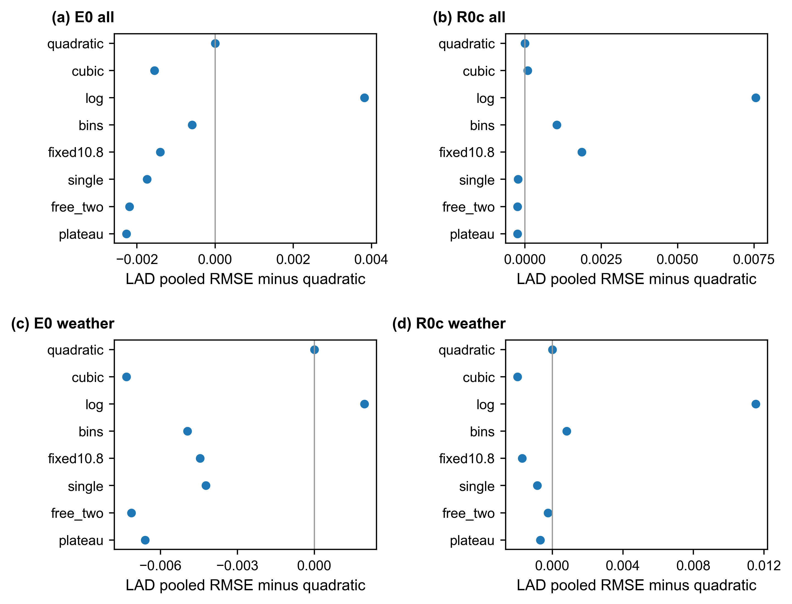
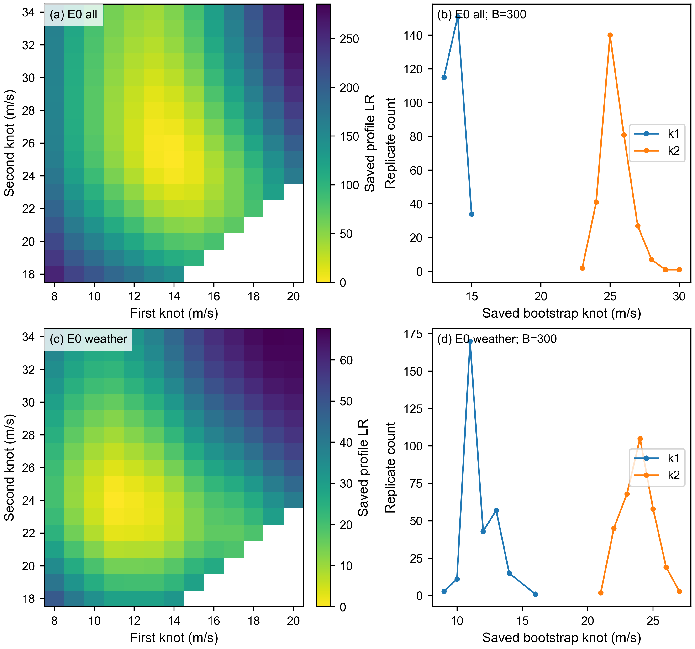

# Supplementary Information

## Appendix A. Data sources, variables and analysis samples

### A.1 Study setting and data sources

The incident analyses combine UK Power Networks (UKPN) restoration records, matched weather and local authority district (LAD) characteristics. The records, reported under Ofgem’s Annex F framework, cover London, the South East and the East of England from 1 April 2021 to 31 March 2024, spanning three regulatory years. A source row describes a restoration stage. Several rows may therefore refer to one incident. Appendix B explains how these stages are converted to incident outcomes and how a representative record is selected for matching.

Weather is drawn from the Open-Meteo historical service using ERA5-based reanalysis. ERA5 provides a spatially complete reanalysis rather than a sensor measurement at each incident location. [14](https://rmets.onlinelibrary.wiley.com/doi/10.1002/qj.3803) The incident coordinates and starting hour determine the matched gust, temperature and mean sea-level pressure; precipitation is the matched 24-hour accumulation. Gust in these analyses is an hourly matched variable, not a district daily maximum. The LAD definition uses the December 2021 boundaries. ONS population and urban–rural classification are combined with the income-deprivation measures from the English Indices of Deprivation 2019 described in the main text: the district rate, its within-district range and Moran's I. These regional attributes describe the area in which an incident occurs, rather than the affected customers individually.

### A.2 Cause-code grouping and study inclusion

Table A5 gives the original code grouping. The analysis includes incidents assigned to the weather-related or asset-related categories. Throughout these appendices, *all incidents* means all incidents within this inclusion rule and the relevant analysis sample; it does not mean every raw operational record. *Weather-attributed* identifies the corresponding subset assigned a weather-related cause code. It describes recorded attribution, without asserting that every other incident was unaffected by weather.

**Table A5. Cause-code groups and inclusion in the incident analyses.** Codes are treated as categorical identifiers, including letter–number codes. The inclusion rule is common to the exposure and recovery analyses.

| Cause group | Original codes | Included |
| --- | --- | --- |
| Weather-related | 01, 02, 03, 04, 05, 06, 07, 10, 18, 21, 23, 24, 25, 30, 32, 33 | Yes |
| Asset-related | 14, 15, 16, 17, 19, 22, 26, 64, 67, 70, 71, 72, 73, 76, 77, 78, 90, A1, A2 | Yes |
| Third-party | 39, 40, 41, 42, 43, 44, 45, 48, 49, 50, 53, 54, 55, 56, 57, 58 | No |
| Human error | 60, 61, 62, 63, 65, 66, 68, 69, 81, 82, 83, 84 | No |
| External or customer | 74, 80, 85, 86, 87, 88, 89 | No |
| No fault found or unknown | 75, 97, 98, 99, D, X | No |

The resulting exposure sample contains 9,857 weather-attributed incidents, or 16.3095% of the included incidents. The equivalent proportion in the final recovery sample is 18.0838% (9,254 incidents). These proportions have different denominators because the recovery analysis additionally requires a defined positive duration and a positive affected-customer count (Table A2).

**Table A2. Recorded cause composition of the final all-incident samples.** Counts are incidents, not restoration stages. Percentages are calculated within each margin; the weather-attributed samples consist entirely of the weather-related rows shown here.

| Margin | Cause group | n | Share (%) |
| --- | --- | --- | --- |
| Exposure | Asset-related | 50,580 | 83.6905 |
| Exposure | Weather-related | 9,857 | 16.3095 |
| Recovery | Asset-related | 41,919 | 81.9162 |
| Recovery | Weather-related | 9,254 | 18.0838 |

### A.3 Variables, transformations and matching

The two responses are \(Y_E=\ln(1+C)\), where \(C\) is the reconstructed affected-customer count, and \(Y_R=\ln D_B\), where \(D_B\) is the incident span in hours. The first transformation retains zero-customer incidents in the exposure analysis. The recovery analysis uses positive-customer incidents after the existing duration restrictions. Table A4 defines the variables used in these models and distinguishes the fitted outcomes from alternative descriptive measures.

**Table A4. Variable definitions and units.** Weather variables are matched to the incident, regional variables to its LAD. “Standardised” means subtraction of the fitting sample mean and division by its sample standard deviation. In cross-validation, these quantities are estimated in the training fold and applied unchanged to the held-out observations.

| Variable | Unit or scale | Definition and use |
| --- | --- | --- |
| Affected customers, C | Customers | Sum over non-re-interruption stages; ln(1+C) is the exposure response. |
| Incident span, D_B | Hours | Latest stage end minus earliest stage start; ln D_B is the recovery response. |
| Weighted duration, D_A | Hours | Customer-weighted stage duration; construction comparison only (Appendix B). |
| Gust, g | m/s | Matched starting-hour gust; standardised weather term or physical-unit segment bases. |
| Precipitation, P | mm | Matched 24-hour accumulation; standardised. |
| Temperature, T | °C | Starting-hour temperature; standardised linear and squared terms in final models. |
| Pressure, p | hPa | Starting-hour mean sea-level pressure; standardised. |
| Log population | ln(persons) | LAD population on the stored natural-log scale. |
| Urban indicator | 0/1 | One when the stored urban–rural classification contains “urban”; zero otherwise. |
| Income-deprivation rate | Source proportion | Published district income-deprivation rate, unstandardised. |
| Deprivation range | Stored source scale | Within-district income-deprivation range, unstandardised. |
| Moran’s I | Index | Spatial clustering of deprivation within the district, unstandardised. |
| Year and month | Categories | From UTC incident date; training-level indicators with one category omitted. |
| Log customer control | Standardised ln(1+C) | Recovery predictor, with its square; not a causal effect of incident size. |
| LAD and fold identifiers | Categories | December 2021 district identifier and saved random-fold assignment; not continuous predictors. |

Weather terms and the recovery model's \(\ln(1+C)\) control are standardised before their squares and interactions are formed. The regional variables retain their stored scales: population enters as its natural logarithm, the deprivation measures retain their source scales and Moran's I is an index. The within-district deprivation range retains the published scale rather than being converted to percentage points. The plateau bases use gust in m/s, allowing their knots and segment slopes to retain physical units. Calendar effects are indicator variables with the first available training category omitted; in the full-period design these references are 2021 and January. Regional fixed effects are candidate specifications rather than a component of every final model.

The prepared samples retain the existing spatial and weather matches and missing-data exclusions. Undefined outcomes remain missing rather than being set to zero. There are no missing values among the nine covariates summarised for the final all-incident samples in Table A3. This describes the retained samples; it does not imply complete coverage of every original restoration record.

### A.4 Analysis-sample construction

The prepared input for weather-related and asset-related incidents with complete matching covariates contains 60,453 incidents. Requiring a non-missing affected-customer count gives the exposure sample of 60,437. The recovery preparation additionally requires a positive calculable incident span and applies the existing upper restriction at the 99th percentile of positive durations. This restriction is determined in the combined study-period preparation, before the separate temporal regressions in Appendix E. The saved recovery input contains 59,834 incidents; removing its 8,661 zero-customer incidents gives the final 51,173. Table A1 distinguishes this intermediate input from the four final analysis combinations.

**Table A1. Incident analysis samples.** All rows cover 1 April 2021–31 March 2024. “All” pools the two included cause groups. The recovery input is an intermediate sample, not the denominator used for current recovery-model comparisons. Weather-attributed samples are subsets of their respective final samples.

| Margin | Sample | Incidents | LADs | Zero customers |
| --- | --- | --- | --- | --- |
| Exposure | All, final | 60,437 | 111 | 8,979 |
| Exposure | Weather-attributed, final | 9,857 | 105 | 572 |
| Recovery | Prepared recovery input | 59,834 | 111 | 8,661 |
| Recovery | All, final | 51,173 | 111 | 0 |
| Recovery | Weather-attributed, final | 9,254 | 104 | 0 |

The all-incident analyses both cover 111 LADs. The weather-attributed exposure and recovery samples cover 105 and 104 LADs, respectively. Exposure retains 8,979 zero-customer incidents in the all-incident sample and 572 in the weather-attributed subset. Their retention follows the definition of the exposure response, whereas their exclusion from recovery prevents a recorded time with no interrupted customers from being interpreted as a realised customer-restoration outcome. The construction and observed duration pattern underlying that distinction are given in Appendix B.

### A.5 Covariate distributions and design diagnostics

Table A3 provides the continuous and binary covariate summaries on the final all-incident samples. Mean matched gust is 9.910 m/s for exposure and 10.034 m/s for recovery; the corresponding means of the 24-hour precipitation total are 3.251 and 3.419 mm. The two samples therefore have similar central weather summaries, while their outcome-specific selection remains distinct. These descriptive similarities do not justify treating their fitted errors or likelihoods as directly comparable.

**Table A3. Covariate distributions in the final all-incident samples.** Values are on the input scales, before regression standardisation. The columns give mean, standard deviation (SD), median and interquartile interval (Q1–Q3). Exposure: 60,437 incidents; recovery: 51,173 incidents. All listed variables are non-missing in these samples.

| Sample | Variable | Mean | SD | Median | Q1–Q3 |
| --- | --- | --- | --- | --- | --- |
| Exposure | Gust (m/s) | 9.9102 | 5.2799 | 9.0000 | 6.1000–12.5000 |
| Exposure | Precipitation (mm) | 3.2509 | 5.2596 | 0.8000 | 0.0000–4.3000 |
| Exposure | Temperature (°C) | 11.8832 | 6.0990 | 11.3000 | 7.7645–16.0710 |
| Exposure | Pressure (hPa) | 1012.0748 | 13.0750 | 1013.7000 | 1004.4000–1021.2000 |
| Exposure | Log population | 12.0712 | 0.4847 | 11.9874 | 11.7179–12.4764 |
| Exposure | Urban indicator | 0.7465 | 0.4350 | 1.0000 | 0.0000–1.0000 |
| Exposure | Income-deprivation rate | 0.1088 | 0.0382 | 0.1060 | 0.0770–0.1380 |
| Exposure | Deprivation range | 0.2725 | 0.0828 | 0.2740 | 0.2130–0.3210 |
| Exposure | Moran’s I | 0.2795 | 0.1669 | 0.2900 | 0.1600–0.3800 |
| Recovery | Gust (m/s) | 10.0344 | 5.4010 | 9.0000 | 6.1000–12.7000 |
| Recovery | Precipitation (mm) | 3.4192 | 5.4054 | 0.9000 | 0.0000–4.6000 |
| Recovery | Temperature (°C) | 11.8441 | 6.0624 | 11.2500 | 7.7500–16.0000 |
| Recovery | Pressure (hPa) | 1011.7487 | 13.0833 | 1013.3000 | 1004.0000–1020.9000 |
| Recovery | Log population | 12.0558 | 0.4713 | 11.9729 | 11.7051–12.4729 |
| Recovery | Urban indicator | 0.7334 | 0.4422 | 1.0000 | 0.0000–1.0000 |
| Recovery | Income-deprivation rate | 0.1072 | 0.0379 | 0.1000 | 0.0740–0.1360 |
| Recovery | Deprivation range | 0.2701 | 0.0833 | 0.2660 | 0.2110–0.3210 |
| Recovery | Moran’s I | 0.2752 | 0.1659 | 0.2900 | 0.1600–0.3700 |

Variance inflation factors (VIFs) are computed from the correlation matrix of all non-intercept columns of each final design, including polynomial, interaction and calendar terms. Table A6 reports the diagonal of its inverse. The largest values are 3.75484 for exposure and 3.83743 for recovery, both for the within-district deprivation range. These values describe linear dependence among the specified design columns. They are not tests of omitted-variable bias or of predictive overfitting, which is addressed separately through the comparisons in Appendix C.

**Table A6. VIFs for the final all-incident designs.** The intercept is excluded. A dash means that the term is absent from that design, not that its VIF is zero. The exposure model uses plateau bases; the recovery model uses a quadratic gust function. Calendar indicators are included in the calculation.

| Design term | Exposure VIF | Recovery VIF |
| --- | --- | --- |
| Standardised precipitation | 1.44084 | 1.50461 |
| Standardised temperature | 3.20685 | 3.20200 |
| Standardised pressure | 1.89624 | 1.92315 |
| Gust × pressure | 2.31070 | — |
| Urban indicator | 1.16543 | 1.16711 |
| Log population | 1.33932 | 1.31862 |
| Income-deprivation rate | 2.57814 | 2.64092 |
| Deprivation range | 3.75484 | 3.83743 |
| Moran’s I | 2.50887 | 2.53178 |
| Year 2022 | 1.95486 | 1.93255 |
| Year 2023 | 1.86338 | 1.82797 |
| Year 2024 | 2.17787 | 2.12733 |
| Month 2 | 2.11475 | 2.17259 |
| Month 3 | 1.86173 | 1.83863 |
| Month 4 | 1.98796 | 1.94979 |
| Month 5 | 2.47287 | 2.42011 |
| Month 6 | 3.25378 | 3.26144 |
| Month 7 | 3.54160 | 3.54095 |
| Month 8 | 3.05142 | 3.00531 |
| Month 9 | 2.87136 | 2.84756 |
| Month 10 | 2.79582 | 2.78509 |
| Month 11 | 2.36601 | 2.35858 |
| Month 12 | 2.18102 | 2.20233 |
| Standardised temperature squared | 1.27136 | 1.28021 |
| Gust low-segment basis | 1.73489 | — |
| Gust ramp basis | 3.07567 | — |
| Standardised gust | — | 2.39390 |
| Standardised gust squared | — | 1.84847 |
| Standardised log(1+C) | — | 1.75586 |
| Standardised log(1+C) squared | — | 1.75028 |
| Gust × precipitation | — | 1.21579 |

Recorded weather attribution increases across the gust groups in Table A7, from 6.9327% in the lowest group to 57.0619% in the highest. These are the existing ten ordered gust groups in the 60,453-incident prepared input; ties produce unequal group sizes. The highest group spans 16.9–39.4 m/s. This table describes changing cause composition across observed weather conditions. It does not estimate the probability that a district experiences an incident.

**Table A7. Weather-attributed share in the existing ten gust groups.** Unit: incident. The denominator is the prepared input for weather-related and asset-related incidents (60,453 incidents), before the exposure response's missing-value exclusion. Gust ranges are the actual minimum and maximum in each group; percentages use each row's incident count.

| Gust group | n | Observed range (m/s) | Weather-attributed (%) |
| --- | --- | --- | --- |
| 1 | 6,289 | 0.5–4.2 | 6.9327 |
| 2 | 5,907 | 4.3–5.5 | 8.0582 |
| 3 | 6,161 | 5.6–6.7 | 9.1868 |
| 4 | 6,011 | 6.8–7.8 | 10.0982 |
| 5 | 6,385 | 7.9–9.0 | 10.6186 |
| 6 | 5,850 | 9.1–10.2 | 10.8889 |
| 7 | 5,912 | 10.3–11.6 | 12.4154 |
| 8 | 6,086 | 11.7–13.6 | 15.1660 |
| 9 | 5,855 | 13.7–16.8 | 23.5354 |
| 10 | 5,997 | 16.9–39.4 | 57.0619 |

## Appendix B. Event reconstruction and recovery-sample definition

### B.1 From restoration stages to incident outcomes

The analysis needs one affected-customer count and one elapsed restoration span per incident. Let \(j\) index the restoration stages associated with incident \(i\), with reported customers \(c_{ij}\), start \(s_{ij}\), end \(e_{ij}\), and re-interruption indicator \(r_{ij}\). The two outcomes are constructed as

\[
C_i=\sum_{j:r_{ij}=0}c_{ij},\qquad
D_{B,i}=\frac{\max_j e_{ij}-\min_j s_{ij}}{1\ \mathrm{hour}}.
\]

The customer sum excludes stages marked as re-interruptions, while the incident span includes their timestamps. This separates the counting rule from the elapsed time over which the incident remains represented in the records. A re-interruption can extend the latter without adding its stage customer count to the former. If no eligible customer count is available, \(C_i\) remains missing; an observed sum of zero remains zero.

**Table B1. Operational rules for reconstruction.** Rules apply within an incident reference. Missing values are not converted to zero. Duration restrictions used for analysis are applied after construction.

| Quantity or operation | Rule |
|---|---|
| Incident key | Group stages by their stripped incident-reference identifier. |
| Customer parsing | Parse reported counts numerically after removal of thousands separators; retain unparseable values as missing. |
| Re-interruption | Strip whitespace and normalise case; flags Y and 1 identify re-interruption stages. |
| Affected customers | Sum available counts from non-re-interruption stages, requiring at least one available count. |
| Incident span | Use the earliest available stage start and latest available stage end across all stages; convert elapsed time to hours. |
| Representative row | Sort by parsed stage start with the existing deterministic source-row tie breaker; select the earliest record. |
| Undefined endpoints | If an endpoint needed for the span is unavailable, retain a missing duration. Non-positive spans do not enter the recovery analysis. |

### B.2 Representative records and boundary cases

The representative row determines incident-level attributes used for matching, including the location, starting hour and recorded cause. Selecting it chronologically avoids letting the order of rows in the source file determine those attributes. Equal earliest start times are resolved with the deterministic source-row rule. A tie in start time is not by itself evidence that restoration stages are duplicates, and it does not alter the separate customer and span aggregations.

The construction summary in Table B2 concerns the wider assembled incident records, before the analysis restrictions in Appendix A. Among 135,025 incident references, 24,893 have a tie at the earliest start. Chronological selection differs from the original representative-row selection in 12,886 incidents (9.5434%). All stage starts in this construction summary were parseable. These counts establish why chronological selection and a tie rule matter; they are not additional incidents in the final regression samples.

**Table B2. Representative-record selection in the assembled incident records.** The denominator is 135,025 incident references, not the final exposure or recovery sample.

| Record feature | Count |
| --- | --- |
| Incident references | 135,025 |
| Incidents with equal earliest starts | 24,893 |
| Representative selection differs from source selection | 12,886 |
| Unparseable stage starts | 0 |
| Incidents without a parseable start | 0 |

Several boundary cases have different consequences for the two outcomes. An incident can have a genuine zero count but a positive recorded span. An incident with all eligible customer counts missing has an undefined count, even if its timestamps are complete. Missing stage endpoints can leave some individual stage durations undefined while an incident span remains calculable from the available endpoints. Negative individual stage durations are excluded from the weighted-duration calculation below. These distinctions preserve the meanings of zero, missing and positive duration instead of assigning a common replacement value.

### B.3 Zero-customer records and the recovery sample

The recovery analysis concerns incidents in which customers were interrupted. Its final sample therefore excludes zero-customer records from the already prepared positive-duration input. Table B3 shows the associated pattern in recorded duration: 5,761 of 8,661 zero-customer incidents have a span of exactly one hour (66.5166%), compared with 259 of 51,173 positive-customer incidents (0.5061%). The concentration is an observed recording feature. These fields alone do not identify a particular restoration mechanism or establish why a one-hour value was recorded.

**Table B3. Recorded spans of exactly one hour by customer-count status.** Unit: incident in the prepared recovery input, after restriction to positive durations and exclusion above the duration cap. The final recovery analysis uses the positive-customer row.

| Sample | n | Exactly one hour | Share (%) |
| --- | --- | --- | --- |
| Zero customers | 8,661 | 5,761 | 66.5166 |
| Positive customers, final | 51,173 | 259 | 0.5061 |
| Prepared recovery input | 59,834 | 6,020 | 10.0612 |

The exclusion removes records that cannot be interpreted as customer-restoration times under the response definition; it is not a deletion based on a fitted residual or a candidate model's performance. The full exposure sample continues to retain zero-customer records. Appendix A provides the corresponding sample counts without requiring the same inclusion rule for two different outcomes.

### B.4 Incident span and customer-weighted duration

A customer-weighted stage duration answers a different question from total incident span. For stages with available customer counts and non-negative, calculable durations \(d_{ij}=(e_{ij}-s_{ij})/(1\ \mathrm{hour})\), the existing comparison measure is

\[
D_{A,i}=\frac{\sum_{j\in\mathcal V_i}c_{ij}d_{ij}}
{\sum_{j\in\mathcal V_i}c_{ij}},
\]

provided the denominator is positive. Here \(\mathcal V_i\) contains stages meeting those availability conditions. Unlike the construction of \(C_i\), this comparison does not exclude re-interruption stages. It weights stage durations by their reported customer counts; \(D_B\) measures the span from the first start to the last end. Neither definition is a substitute for the other without changing the estimand.

In the 51,173 positive-customer recovery incidents with both measures available, mean \(D_A\) is 8.1667 h and mean \(D_B\) is 12.4227 h. Their medians are 4.1667 and 7.4167 h. The mean within-incident difference \(D_B-D_A\) is 4.2560 h, and the measures are equal in 54.2337% of incidents. The incident span is used as the recovery response because the analysis concerns elapsed incident restoration, with incident size included separately as a covariate. The presence of customer counts in both a weighted measure and the exposure response creates a definitional connection; that fact alone does not prove a spurious empirical correlation.

Stage aggregation also changes the exposure measure relative to using only the first stage. In the final exposure sample, the recorded comparison gives a mean of 47.13 customers for the earliest stage and 93.02 for the incident aggregate, a ratio of 1.97. This supports retaining the stage-based aggregation when describing the extent of an incident, rather than treating the representative row as its complete customer outcome.

## Appendix C. Candidate specifications and model comparison

### C.1 Comparison design and candidate definitions

Model specifications are compared within four fixed analysis combinations: all-incident exposure, all-incident recovery, weather-attributed exposure and weather-attributed recovery. Their sample sizes are 60,437, 51,173, 9,857 and 9,254, respectively. Exposure uses \(\ln(1+C)\); recovery uses \(\ln D_B\). The weather-attributed combinations are the corresponding final-sample subsets, not alternative datasets selected for giving smaller errors. Earlier recovery results based on 59,834 incidents are not included in the current sample-matched rankings.

There are two complementary sets of candidates. The original specifications, H01–H12, reproduce the established covariate ladder and its alternatives. H13 and H14 represent the additional candidates with one or two free knots used in the main comparison. The matched-control set, F01–F08, changes the gust function while holding the other predictors fixed. This separation prevents improvements from a temperature term or a changed interaction from being attributed solely to the gust function.

Write \(z_g,z_P,z_T,z_p\) for standardised gust, precipitation, temperature and pressure. Let \(S\) denote the five regional terms: log population, urban indicator, income-deprivation rate, deprivation range and Moran's I; \(K\) denotes year and month indicators. Every recovery candidate additionally contains standardised \(\ln(1+C)\) and its square. All specifications include an intercept. Table C1 defines the models independently of earlier short names that were used differently in different comparisons.

**Table C1. Candidate specifications.** H labels identify the original specifications and their two free-knot extensions; F labels identify the matched-control function comparison. The operator \((x)_+=\max(x,0)\). “Training quantiles” are gust quantiles 0.50, 0.75, 0.90 and 0.97; step bases are four indicators for gust at or above these cut points. The customer controls described above are present in every recovery row.

| ID | Specification | Terms or change |
| --- | --- | --- |
| H01 | Linear weather | z_g + z_P + z_T + z_p |
| H02 | Gust quadratic | H01 + z_g² |
| H03 | Gust–pressure interaction | H02 + z_g z_p |
| H04 | Regional block | H03 + S |
| H05 | Calendar effects | H04 + K |
| H06 | Cubic gust | H05 + z_g³ |
| H07 | Log gust | H05, replacing z_g + z_g² by ln(1+g) |
| H08 | Fixed single hinge | H05, replacing z_g² by (g−10.8)₊ |
| H09 | Gust steps | H05, replacing z_g + z_g² by four training-quantile indicators |
| H10 | Full quadratic weather | H05 + z_T² + z_P² + z_g z_P |
| H11 | LAD fixed effects | H05 + LAD indicators |
| H12 | Without regional block | H03 + K |
| H13 | Free single knot | H05, replacing z_g² by (g−k)₊; k selected on fitting observations |
| H14 | Free double knot | H05, replacing z_g + z_g² by an unrestricted two-hinge gust function |
| F01 | Quadratic | z_g + z_g² |
| F02 | Cubic | z_g + z_g² + z_g³ |
| F03 | Log gust | ln(1+g) |
| F04 | Steps | Four training-quantile indicators |
| F05 | Fixed single hinge | z_g + (g−10.8)₊ |
| F06 | Free single knot | z_g + (g−k)₊ |
| F07 | Free double knot | Three free segment slopes; two searched knots |
| F08 | Plateau | Two free segment slopes, followed by zero main-function slope; two searched knots |

For F01–F08, the common non-gust block is \(z_P+z_T+z_p+z_T^2+S+K\). Exposure retains \(z_gz_p\); recovery instead retains \(z_gz_P\), along with the customer controls. In H01–H14, interactions and temperature terms follow the original definitions in Table C1. A plateau constrains the *main gust function* above its upper knot. With a gust interaction retained, the total conditional gust relationship need not be flat away from the interacting variable's standardisation mean.

All models are fitted by ordinary least squares on the stated log response. The reported Gaussian information criteria use \(k=\operatorname{rank}(X)\), the number of linearly independent design columns including the intercept. With residual sum of squares SSE,

\[
\begin{aligned}
\mathrm{AIC}&=n\{\ln(\mathrm{SSE}/n)+1+\ln(2\pi)\}+2k,\\
\mathrm{BIC}&=n\{\ln(\mathrm{SSE}/n)+1+\ln(2\pi)\}+k\ln n.
\end{aligned}
\]

This is the established conditional parameter-count convention: the residual-variance parameter and searched knot locations are not added to \(k\). The criteria therefore do not claim to penalise all the complexity of knot search. Comparisons of AIC or BIC are made only within the same response, observations and candidate set. Simplified BIC values from earlier knot-search summaries, which omit the Gaussian constant, are not mixed with these values.

The primary predictive comparison uses five LAD-grouped folds, withholding whole districts. The district list is shuffled with the fixed seed 20260908 and assigned cyclically to the five folds; the assignment is common to candidates within each analysis combination. Means, standard deviations, categorical encodings and data-dependent gust cut points are learned from each training fold. Free knots are selected by minimising training SSE inside the outer fold. The test observations play no part in their selection. Appendix D details the knot grids and distinguishes this evaluation from predictions using globally selected fixed knots.

The original twelve specifications also retain the existing random-fold and leave-one-calendar-year-out evaluations. Random-fold results use observations with the saved fold assignment: 48,324 and 7,750 exposure incidents, and 41,177 and 7,277 recovery incidents, for all and weather-attributed samples respectively. Year holdouts concern calendar years 2021–2024, not three regulatory-year partitions. These designs have different test collections and are shown separately. For each design, RMSE is pooled over observation-level held-out errors,

\[
\mathrm{RMSE}_{\mathrm{OOF}}=
\sqrt{\frac{1}{N_{\mathrm{OOF}}}\sum_{i\in\mathrm{OOF}}(y_i-\hat y_i)^2},
\]

rather than an unweighted average of fold RMSEs. It is measured on the log-response scale, not in customers or hours.

### C.2 The original covariate ladder

Table C6 preserves the complete original specifications and the two free-knot extensions on each final sample. H01–H05 successively add the quadratic gust term, gust–pressure interaction, regional block and calendar effects. H06–H12 are the established alternatives to that sequence; they should not be read as seven further cumulative additions. H13 and H14 provide the free-knot extensions. Random and year-holdout evaluation were not part of the latter two extensions, so their empty entries are not failed fits.

**Table C6. Original candidate specifications on the final samples.** AIC and BIC are full-sample log-response Gaussian OLS criteria using rank \(k\); their comparison baseline is the other candidates in the same panel. LAD, random and year columns are pooled held-out RMSEs under the distinct designs in C.1. H08 uses the fixed 10.8 m/s knot, H09 uses training-fold quantiles, and H13/H14 reselect their free knots in each LAD training fold. A dash denotes a design not included for that candidate. Full-precision values are retained in the accompanying result tables.

**All-incident exposure (n = 60,437).**

| ID | k | AIC | BIC | LAD RMSE | Random RMSE | Year RMSE |
| --- | --- | --- | --- | --- | --- | --- |
| H01 | 5 | 255709.31 | 255754.35 | 2.00724047 | 2.01813761 | 2.01165079 |
| H02 | 6 | 254975.88 | 255029.94 | 1.99513587 | 2.00359171 | 1.99739922 |
| H03 | 7 | 254961.16 | 255024.23 | 1.99489171 | 2.00398657 | 1.99750573 |
| H04 | 12 | 254547.97 | 254656.09 | 1.99087570 | 1.99647492 | 1.99128948 |
| H05 | 26 | 254396.15 | 254630.40 | 1.98868227 | 1.99445283 | 1.99398424 |
| H06 | 27 | 254307.55 | 254550.80 | 1.98714578 | 1.99282032 | 1.99301339 |
| H07 | 25 | 254611.42 | 254836.66 | 1.99232821 | 1.99527465 | 1.99946355 |
| H08 | 26 | 254325.22 | 254559.46 | 1.98733013 | 1.99268873 | 1.99184958 |
| H09 | 28 | 254379.41 | 254631.67 | 1.98824701 | 1.99433056 | 1.99175945 |
| H10 | 29 | 254301.58 | 254562.85 | 1.98717081 | 1.99220007 | 1.99337909 |
| H11 | 132 | 253351.98 | 254541.21 | 2.10198593 | 1.97702235 | 1.97702488 |
| H12 | 21 | 254786.64 | 254975.84 | 1.99236650 | 2.00156174 | 2.00055917 |
| H13 | 26 | 254300.19 | 254534.43 | 1.98693953 | — | — |
| H14 | 27 | 254257.82 | 254501.08 | 1.98647942 | — | — |

**All-incident recovery (n = 51,173).**

| ID | k | AIC | BIC | LAD RMSE | Random RMSE | Year RMSE |
| --- | --- | --- | --- | --- | --- | --- |
| H01 | 7 | 161679.14 | 161741.04 | 1.17487784 | 1.18899057 | 1.19609429 |
| H02 | 8 | 160889.76 | 160960.51 | 1.16586353 | 1.17711942 | 1.18413326 |
| H03 | 9 | 160867.40 | 160946.99 | 1.16565777 | 1.17780113 | 1.18362614 |
| H04 | 14 | 160139.87 | 160263.67 | 1.15974714 | 1.16949062 | 1.17597346 |
| H05 | 28 | 159323.51 | 159571.11 | 1.15057281 | 1.15667337 | 1.17602963 |
| H06 | 29 | 159318.44 | 159574.89 | 1.15065727 | 1.15662561 | 1.17297010 |
| H07 | 27 | 159724.72 | 159963.48 | 1.15514171 | 1.16294644 | 1.18789534 |
| H08 | 28 | 159505.21 | 159752.81 | 1.15261808 | 1.16172560 | 1.18338624 |
| H09 | 30 | 159416.84 | 159682.12 | 1.15165406 | 1.16275396 | 1.17969315 |
| H10 | 31 | 159299.14 | 159573.28 | 1.15033692 | 1.15686325 | 1.17556491 |
| H11 | 134 | 158351.45 | 159536.41 | 1.19381566 | 1.14798937 | 1.16771708 |
| H12 | 23 | 160105.93 | 160309.32 | 1.15709085 | 1.16595878 | 1.18237793 |
| H13 | 28 | 159293.74 | 159541.35 | 1.15035128 | — | — |
| H14 | 29 | 159281.47 | 159537.92 | 1.15029975 | — | — |

**Weather-attributed exposure (n = 9,857).**

| ID | k | AIC | BIC | LAD RMSE | Random RMSE | Year RMSE |
| --- | --- | --- | --- | --- | --- | --- |
| H01 | 5 | 43413.73 | 43449.71 | 2.18959292 | 2.19330363 | 2.19361229 |
| H02 | 6 | 43377.67 | 43420.85 | 2.18604114 | 2.19388929 | 2.20471208 |
| H03 | 7 | 43364.77 | 43415.14 | 2.18463276 | 2.19397843 | 2.20127973 |
| H04 | 12 | 43348.05 | 43434.40 | 2.18812519 | 2.19336742 | 2.20054461 |
| H05 | 26 | 43270.28 | 43457.37 | 2.17840683 | 2.18892922 | 2.21478612 |
| H06 | 27 | 43210.11 | 43404.40 | 2.17136582 | 2.17545545 | 2.19522081 |
| H07 | 25 | 43282.39 | 43462.29 | 2.17991005 | 2.17805292 | 2.19899189 |
| H08 | 26 | 43233.60 | 43420.70 | 2.17409104 | 2.17565220 | 2.19783347 |
| H09 | 28 | 43229.98 | 43431.46 | 2.17404221 | 2.17746904 | 2.19837063 |
| H10 | 29 | 43237.70 | 43446.38 | 2.17470643 | 2.18968587 | 2.20628047 |
| H11 | 126 | 43236.80 | 44143.49 | 2.88999432 | 2.19325079 | 2.21378823 |
| H12 | 21 | 43287.62 | 43438.74 | 2.17484486 | 2.18967689 | 2.21601865 |
| H13 | 26 | 43233.87 | 43420.97 | 2.17429934 | — | — |
| H14 | 27 | 43204.58 | 43398.87 | 2.17171809 | — | — |

**Weather-attributed recovery (n = 9,254).**

| ID | k | AIC | BIC | LAD RMSE | Random RMSE | Year RMSE |
| --- | --- | --- | --- | --- | --- | --- |
| H01 | 7 | 31492.14 | 31542.07 | 1.32999908 | 1.40168374 | 1.46626318 |
| H02 | 8 | 31383.70 | 31440.76 | 1.32220871 | 1.39469707 | 1.43071804 |
| H03 | 9 | 31369.06 | 31433.26 | 1.32095196 | 1.40849978 | 1.42663497 |
| H04 | 14 | 31338.72 | 31438.58 | 1.32093847 | 1.40601273 | 1.42789172 |
| H05 | 28 | 30314.99 | 30514.71 | 1.25044594 | 1.28374666 | 1.45933649 |
| H06 | 29 | 30286.69 | 30493.54 | 1.24887261 | 1.30389592 | 1.46929826 |
| H07 | 27 | 30442.34 | 30634.93 | 1.26038305 | 1.29705976 | 1.52368645 |
| H08 | 28 | 30297.81 | 30497.52 | 1.24968168 | 1.29439528 | 1.48708885 |
| H09 | 30 | 30333.35 | 30547.33 | 1.25196640 | 1.29792890 | 1.48857292 |
| H10 | 31 | 30268.59 | 30489.71 | 1.24801059 | 1.27554830 | 1.45161809 |
| H11 | 127 | 30231.91 | 31137.77 | 1.65574569 | 1.28275059 | 1.46777824 |
| H12 | 23 | 30337.01 | 30501.06 | 1.24999802 | 1.28629999 | 1.45789833 |
| H13 | 28 | 30297.98 | 30497.70 | 1.25084620 | — | — |
| H14 | 29 | 30292.05 | 30498.90 | 1.24996527 | — | — |

Across the H01–H05 sequence, LAD RMSE decreases from 2.007240 to 1.988682 for all-incident exposure and from 1.174878 to 1.150573 for all-incident recovery. The corresponding changes in the weather-attributed samples are 2.189593 to 2.178407 and 1.329999 to 1.250446. The changes are not uniformly monotone: in weather-attributed exposure, adding the regional block at H04 increases LAD RMSE from 2.184633 to 2.188125 before calendar effects reduce it at H05. The ladder thus describes the performance of specified blocks in context, rather than assigning each block an invariant predictive benefit.

The earlier weather-specific comparison used three named models: the quadratic “paper” specification, a “hinge” specification and the final specification. Their formulas are retained separately in Table C4. In exposure, “hinge” denotes a plateau at 11 and 24 m/s without the temperature square. In recovery, it denotes a single knot at 11 m/s with gust–pressure interaction and no temperature square. The final recovery specification adds the temperature square and replaces gust–pressure with gust–precipitation. Those simultaneous changes preclude interpreting the original three-model sequence as a pure gust-function experiment.

**Table C4. Existing weather-specific and final-model reference comparisons.** These references are kept separate from the matched-control ranking. Knots marked “global fixed” were selected using the full sample and held fixed during CV; “none” denotes a model without knots. All rows use the current sample for their combination. LAD RMSE is on the log-response scale. The final references for the two all-incident analyses are included to identify the main-text specifications.

| Analysis | Reference | Gust form | BIC | LAD RMSE | Knot treatment |
| --- | --- | --- | --- | --- | --- |
| All-incident exposure | Final | plateau | 254416.12 | 1.98475721 | global fixed |
| Weather-attributed exposure | Paper | quadratic | 43457.37 | 2.17840683 | none |
| Weather-attributed exposure | Hinge | plateau | 43396.91 | 2.17139401 | global fixed |
| Weather-attributed exposure | Final | plateau | 43365.03 | 2.16686186 | global fixed |
| All-incident recovery | Final | quadratic | 159553.60 | 1.15025264 | none |
| Weather-attributed recovery | Paper | quadratic | 30514.71 | 1.25044594 | none |
| Weather-attributed recovery | Hinge | single hinge | 30497.70 | 1.24966586 | global fixed |
| Weather-attributed recovery | Final | single hinge | 30449.46 | 1.24592052 | global fixed |

### C.3 Gust functions under matched controls

Table C5 isolates the eight gust functions under the common controls in C.1. The single free knot, free double knot and plateau are selected within each LAD training fold for their predictive evaluation. The current main functions correspond to F08 for both exposure combinations, F01 for all-incident recovery and F06 for weather-attributed recovery. Their full-sample specifications are, respectively, plateaux at 14/25 and 11/24 m/s, a quadratic, and a single knot at 11 m/s. The recovery functions are therefore not uniformly quadratic.

**Table C5. Matched-control gust-function comparisons.** All candidates within a panel use identical observations and non-gust controls. AIC/BIC share the rank-based convention in C.1 and are comparable within the panel. Knots list full-sample estimates in m/s; F05 fixes 10.8 m/s. LAD RMSE for F06–F08 includes training-fold knot reselection, whereas F04 estimates its step cut points from each training fold. The displayed knot values must not be read as fixed throughout this CV.

**All-incident exposure (n = 60,437).**

| ID | k | AIC | BIC | LAD RMSE | Full-sample knots |
| --- | --- | --- | --- | --- | --- |
| F01 | 27 | 254311.22 | 254554.47 | 1.98724789 | — |
| F02 | 28 | 254221.91 | 254474.17 | 1.98569832 | — |
| F03 | 26 | 254536.91 | 254771.16 | 1.99107138 | — |
| F04 | 29 | 254285.66 | 254546.94 | 1.98666119 | — |
| F05 | 27 | 254237.32 | 254480.57 | 1.98584368 | 10.8 (fixed) |
| F06 | 27 | 254215.46 | 254458.71 | 1.98550706 | 13 |
| F07 | 28 | 254173.39 | 254425.65 | 1.98506027 | 14/26 |
| F08 | 27 | 254172.86 | 254416.12 | 1.98497785 | 14/25 |

**All-incident recovery (n = 51,173).**

| ID | k | AIC | BIC | LAD RMSE | Full-sample knots |
| --- | --- | --- | --- | --- | --- |
| F01 | 29 | 159297.15 | 159553.60 | 1.15025264 | — |
| F02 | 30 | 159294.60 | 159559.89 | 1.15034226 | — |
| F03 | 28 | 159971.94 | 160219.54 | 1.15780869 | — |
| F04 | 31 | 159386.50 | 159660.64 | 1.15129236 | — |
| F05 | 29 | 159466.92 | 159723.36 | 1.15211417 | 10.8 (fixed) |
| F06 | 29 | 159269.53 | 159525.98 | 1.15002867 | 17 |
| F07 | 30 | 159259.68 | 159524.97 | 1.15001065 | 15/20 |
| F08 | 29 | 159266.82 | 159523.27 | 1.15001158 | 17/33 |

**Weather-attributed exposure (n = 9,857).**

| ID | k | AIC | BIC | LAD RMSE | Full-sample knots |
| --- | --- | --- | --- | --- | --- |
| F01 | 27 | 43236.55 | 43430.84 | 2.17449785 | — |
| F02 | 28 | 43173.73 | 43375.22 | 2.16716843 | — |
| F03 | 26 | 43252.79 | 43439.88 | 2.17645423 | — |
| F04 | 29 | 43190.57 | 43399.26 | 2.16955568 | — |
| F05 | 27 | 43198.93 | 43393.22 | 2.17004077 | 10.8 (fixed) |
| F06 | 27 | 43199.25 | 43393.54 | 2.17027206 | 11 |
| F07 | 28 | 43166.22 | 43367.71 | 2.16737002 | 11/26 |
| F08 | 27 | 43170.74 | 43365.03 | 2.16789683 | 11/24 |

**Weather-attributed recovery (n = 9,254).**

| ID | k | AIC | BIC | LAD RMSE | Full-sample knots |
| --- | --- | --- | --- | --- | --- |
| F01 | 29 | 30266.77 | 30473.62 | 1.24760848 | — |
| F02 | 30 | 30233.70 | 30447.69 | 1.24563891 | — |
| F03 | 28 | 30434.19 | 30633.91 | 1.25913779 | — |
| F04 | 31 | 30276.84 | 30497.96 | 1.24841701 | — |
| F05 | 29 | 30242.02 | 30448.87 | 1.24589509 | 10.8 (fixed) |
| F06 | 29 | 30242.60 | 30449.46 | 1.24675551 | 11 |
| F07 | 30 | 30239.31 | 30453.29 | 1.24735862 | 10/34 |
| F08 | 29 | 30238.41 | 30445.26 | 1.24692410 | 10/32 |

For all-incident exposure, the plateau has the lowest BIC (254,416.11715) and LAD RMSE (1.98497785) among these matched-control candidates. The unrestricted double-knot function is close in prediction (1.98506027), while the quadratic gives 1.98724789. This comparison supports the plateau as a parsimonious description of the fitted exposure relationship under the stated controls; the error differences remain small on the log-response scale.

The other combinations do not give the current function the smallest LAD error. For all-incident recovery, the quadratic gives 1.15025264 compared with 1.15001065 for the free double-knot function, an absolute gap of 0.00024199. The plateau has the lowest BIC, 30.33212 below the quadratic. For weather-attributed exposure, the plateau retains the lowest BIC, but its LAD RMSE of 2.16789683 exceeds the cubic's 2.16716843 by 0.00072840. For weather-attributed recovery, the current single-knot form gives 1.24675551 versus 1.24563891 for the cubic, a difference of 0.00111660; its BIC is 4.19299 above the plateau's minimum.

These comparisons provide both favourable and unfavourable evidence for the current specifications. The small predictive differences do not establish equivalence, nor do they quantify the operational value of changing a model: no such decision threshold or uncertainty analysis for the differences is part of this comparison. They also do not justify describing every current function as optimal. Figure C1 provides a compact view of the full set, while Table C5 retains the numerical distinctions.

**Figure C1. Difference in LAD-grouped RMSE relative to the quadratic function, under matched controls.** Each point is a candidate’s pooled RMSE minus F01’s pooled RMSE in the same sample; negative values favour the candidate. The vertical line marks zero difference. E0 denotes exposure and R0c denotes recovery; panels (a, b) use all incidents and (c, d) the weather-attributed samples. Axes have different ranges, and errors are on the respective log-response scales. Function labels follow F01–F08 in Table C1, including the fixed 10.8 m/s hinge. Knot selection follows Table C5.

### C.4 District fixed effects and the scope of model selection

Table C7 compares H05 with H11, which adds LAD indicators to the same specification. The indicators improve within-sample adjusted \(R^2\) in all four combinations. They do not improve transfer to omitted districts under the established prediction rule: an unseen LAD receives zeros for its LAD indicator columns, retaining the common intercept and other predictors. This is the original encoding convention, not a special penalty introduced for this comparison.

**Table C7. LAD fixed-effect contrast.** H05 has regional covariates and calendar effects; H11 additionally has LAD indicators. Adjusted \(R^2\) is in-sample, while LAD RMSE withholds entire districts. The comparisons use the same final sample and fold assignment within each combination; AIC/BIC and parameter counts are in Table C6.

| Analysis | ID | Adjusted R² | LAD RMSE |
| --- | --- | --- | --- |
| All-incident exposure | H05 | 0.033611 | 1.98868227 |
| All-incident exposure | H11 | 0.051827 | 2.10198593 |
| Weather-attributed exposure | H05 | 0.042768 | 2.17840683 |
| Weather-attributed exposure | H11 | 0.055568 | 2.88999432 |
| All-incident recovery | H05 | 0.111878 | 1.15057281 |
| All-incident recovery | H11 | 0.130390 | 1.19381566 |
| Weather-attributed recovery | H05 | 0.286675 | 1.25044594 |
| Weather-attributed recovery | H11 | 0.300510 | 1.65574569 |

For example, all-incident exposure adjusted \(R^2\) rises from 0.033611 to 0.051827, while LAD RMSE increases from 1.988682 to 2.101986. The corresponding recovery RMSEs are 1.150573 and 1.193816. The deterioration is larger in the weather-attributed samples, from 2.178407 to 2.889994 for exposure and from 1.250446 to 1.655746 for recovery. The contrast distinguishes fitting differences between observed districts from predicting outcomes in districts whose fixed effects have not been estimated. It supports considering the intended prediction setting alongside in-sample fit, without implying that district effects lack explanatory value.

The main specifications retain interpretable gust functions and measured regional covariates. Their comparative support varies by margin, sample and criterion as shown above. Knot-location uncertainty is a separate question, addressed in Appendix D; it cannot be inferred from a small difference between two predictive RMSEs.

## Appendix D. Knot estimation and uncertainty

### D.1 Functions and search objective

Segmented regression allows changes in slope at estimated breakpoints. [27](https://onlinelibrary.wiley.com/doi/10.1002/sim.1545) Here the knot parameters are selected by an explicit grid search, with ordinary least squares coefficients fitted conditionally at each admissible grid point. For a free double-knot function,

\[
f_{\mathrm{free}}(g)=b_g g+b_1(g-k_1)_++b_2(g-k_2)_+,
\]

the slopes in the three segments are \(b_g\), \(b_g+b_1\) and \(b_g+b_1+b_2\). The plateau parameterisation instead uses

\[
f_{\mathrm{plat}}(g)=b_L\min(g,k_1)
+b_R\min\{(g-k_1)_+,k_2-k_1\},
\]

with main-function slopes \(b_L,b_R,0\). The latter restriction is on the main gust term, not automatically on a conditional relationship that also contains a gust interaction. Gust and knots are in m/s; linear rescaling of the free function's bases does not change the fitted space.

For a single free knot, the search covers integer values from 8 to 30 m/s. For two knots, the full search uses \(k_1=8,\ldots,20\), \(k_2=18,\ldots,34\) and \(k_2-k_1\geq4\) m/s. At each candidate the non-gust controls are retained, and the selected pair minimises SSE on the fitting observations. A full-sample minimum supplies a descriptive point estimate; a training-fold minimum supplies the knots for that fold's held-out predictions. These are different uses of the same fitting criterion.

The free-function summaries in Tables D1 and D2 use the original H05 controls with its quadratic gust term replaced by hinges; they retain gust–pressure and do not include temperature squared. The plateau summaries add temperature squared and retain gust–pressure for exposure, but omit the gust interaction for recovery. The recovery controls still include log customer count and its square. Thus each uncertainty summary belongs to its stated specification; Table C5, rather than a comparison between these branches, supplies the matched-control function comparison.

### D.2 Profile regions and district bootstrap

The saved profile surface is

\[
\mathrm{LR}(k_1,k_2)=n\ln\left\{
\frac{\mathrm{SSE}(k_1,k_2)}{\mathrm{SSE}(\hat k_1,\hat k_2)}\right\}.
\]

The reported approximate 95% joint region consists of grid pairs whose LR does not exceed the 95th percentile of \(\chi^2_2\). Table D1 gives the coordinate ranges of that region. They are projections of a joint region, not two separately fitted marginal 95% intervals. The likelihood approximation does not itself account for district or date dependence.

The complementary bootstrap resamples LADs with replacement and includes all incident rows belonging to each selected LAD, with repeated districts contributing repeated rows. It reselects the knots in each replicate while retaining the original design construction and scaling. The free double-knot analysis uses 500 replicates; the plateau analysis uses 300. The reported bootstrap limits are the 2.5th and 97.5th percentiles, with the median also shown. They describe variation under district resampling, without a separate resampling of dates.

The bootstrap uses local integer search windows around the full-sample pair. For the free function these are \([\max(8,\hat k_1-6),\hat k_1+6]\) and \([\max(18,\hat k_2-8),\min(34,\hat k_2+8)]\). For the plateau they are \([\max(8,\hat k_1-5),\hat k_1+5]\) and \([\max(18,\hat k_2-7),\min(34,\hat k_2+7)]\). The minimum separation remains 4 m/s. Thus the first-knot bootstrap window can extend above the full-search bound of 20 m/s; these percentile summaries pertain to the stated resampling windows. Ordinary coefficient standard errors conditional on a chosen knot do not replace either the profile or bootstrap summaries.

**Table D1. Knot estimates and uncertainty summaries.** All values are in m/s. “Profile” gives coordinate ranges of the approximate joint 95% region; bootstrap columns give the 2.5th percentile, median and 97.5th percentile. The final-sample plateau branches are shown separately from the earlier free recovery comparison. The latter includes zero-customer records and must not be interpreted as the current recovery model's uncertainty.

| Analysis | Form | n | Knot | Estimate | Profile | B | Bootstrap low / median / high |
| --- | --- | --- | --- | --- | --- | --- | --- |
| Exposure, all | Free double | 60,437 | k1 | 14 | 13–14 | 500 | 13 / 14 / 15 |
| Exposure, all | Free double | 60,437 | k2 | 26 | 24–29 | 500 | 24 / 26 / 29.525 |
| Recovery, all (historical) | Free double | 59,834 | k1 | 14 | 8–15 | 500 | 8 / 13 / 16 |
| Recovery, all (historical) | Free double | 59,834 | k2 | 20 | 18–21 | 500 | 18 / 19 / 25 |
| Exposure, all | Plateau | 60,437 | k1 | 14 | 13–14 | 300 | 13 / 14 / 15 |
| Exposure, all | Plateau | 60,437 | k2 | 25 | 24–27 | 300 | 24 / 25 / 28 |
| Exposure, weather-attributed | Plateau | 9,857 | k1 | 11 | 10–13 | 300 | 10 / 11 / 14 |
| Exposure, weather-attributed | Plateau | 9,857 | k2 | 24 | 22–26 | 300 | 22 / 24 / 26 |
| Recovery, all | Plateau | 51,173 | k1 | 17 | 16–18 | 300 | 16 / 17 / 20 |
| Recovery, all | Plateau | 51,173 | k2 | 33 | 31–34 | 300 | 29 / 33 / 34 |
| Recovery, weather-attributed | Plateau | 9,254 | k1 | 9 | 8–12 | 300 | 8 / 10 / 14 |
| Recovery, weather-attributed | Plateau | 9,254 | k2 | 33 | 29–34 | 300 | 26 / 32 / 34 |

### D.3 What the estimates locate

For all-incident exposure, the plateau's full-sample knots are 14 and 25 m/s. Their bootstrap intervals are 13–15 and 24–28 m/s. The free double-knot fit gives 14 and 26 m/s, with a similar lower-knot interval but a wider upper interval of 24–29.525 m/s. In each specification, the lower change is more closely located than the upper one. The free and plateau summaries retain their respective controls, so the difference between their point estimates cannot be attributed solely to the slope constraint.

For weather-attributed exposure, the plateau knots are 11 and 24 m/s, with bootstrap intervals of 10–14 and 22–26 m/s. Figure D1 displays the exposure profile surfaces and bootstrap counts. The two samples place the lower change at different point estimates, while their intervals retain overlap. These intervals alone do not constitute a formal between-sample test of knot equality.

**Figure D1. Profile and bootstrap summaries for the exposure plateau.** E0 denotes exposure and B denotes the number of bootstrap replicates. The upper row concerns all incidents and the lower row weather-attributed incidents. Left panels show profile LR over the admissible knot grid; white cells are excluded grid pairs. The colour scales differ between rows. Right panels show bootstrap counts at integer knot locations, with lines joining the counts for each knot; these are not smooth probability densities or confidence bands. Intervals are reported numerically in Table D1.

The positive-customer recovery plateau candidates give 17/33 m/s for all incidents and 9/33 m/s for weather-attributed incidents. Their upper-knot bootstrap intervals are 29–34 and 26–34 m/s, and the profile ranges also reach 34 m/s. The upper location is consequently constrained by the search range in these summaries; it is not tightly localised on both sides by an interior interval. These recovery plateau candidates retain the controls used in their own analysis, including temperature squared but no gust–precipitation interaction. They are not the final quadratic all-incident model or the final 11 m/s single-knot weather-attributed model.

The earlier unrestricted recovery fit in Table D1 uses 59,834 incidents and gives 14/20 m/s, with bootstrap intervals 8–16 and 18–25 m/s. It is retained to identify the original free-knot evidence, rather than being ranked against final-sample fits. The current weather-attributed single-knot value of 11 m/s is a point estimate; Table D1 does not supply an interval for that specification. Neither the historical free-knot interval nor a plateau interval is assigned to it.

### D.4 Training-fold selection and comparative interpretation

Table D2 records the existing outer-fold free double-knot estimates. For exposure, the lower knot is 13 or 14 m/s and the upper knot ranges from 25 to 29 m/s. The recovery rows again concern the earlier 59,834-incident comparison, not the final positive-customer sample. Fold variation records the consequence of changing the training districts; it is not a confidence interval and does not describe the fixed global knots used in other CV summaries.

**Table D2. Free double-knot estimates selected inside LAD training folds.** Values are in m/s; each row supplies knots estimated without the held-out LADs. Exposure uses 60,437 incidents overall. Recovery uses the explicitly historical 59,834-incident sample. The table concerns unrestricted double-knot functions, not plateau functions.

| Analysis | n | Fold | k₁ | k₂ |
| --- | --- | --- | --- | --- |
| Exposure | 60,437 | 1 | 14 | 25 |
| Exposure | 60,437 | 2 | 13 | 29 |
| Exposure | 60,437 | 3 | 14 | 26 |
| Exposure | 60,437 | 4 | 14 | 25 |
| Exposure | 60,437 | 5 | 14 | 26 |
| Recovery (historical) | 59,834 | 1 | 15 | 20 |
| Recovery (historical) | 59,834 | 2 | 13 | 19 |
| Recovery (historical) | 59,834 | 3 | 13 | 20 |
| Recovery (historical) | 59,834 | 4 | 13 | 19 |
| Recovery (historical) | 59,834 | 5 | 8 | 18 |

For predictive comparisons on the four current final samples, Table C5 reports the matched-control evaluations with knot selection inside the training folds. In the existing recovery comparison of plateau, free double-knot and quadratic functions with training-fold knot selection, the quadratic retained gust–pressure, while the free and plateau alternatives omitted it without adding gust–precipitation. Their score differences therefore do not isolate a gust-function effect. Appendix C provides that comparison under the current common controls, leaving the profile and bootstrap results here attached to their original, stated specifications.

## Appendix E. Temporal design for incident-level analyses

### E.1 Periods, samples and information used in fitting

The incident-level temporal analysis compares regressions fitted separately to a development period, 1 April 2021–29 September 2023, and a later period, 30 September 2023–31 March 2024, with both endpoints included. The combined-period fit is a descriptive reference. Table E2 gives the sample sizes and matched-gust means. The later period comprises 30 September and the six complete months from October to March; it is not seven complete months.

**Table E2. Incident-level temporal design and sample support.** Each row is fitted separately using the final all-incident sample for its margin. Mean gust is in m/s. Dates use the existing UTC incident-date convention. The combined rows are reference fits, not additional held-out observations.

| Margin | Period | Start | End | n | Mean gust |
| --- | --- | --- | --- | --- | --- |
| Exposure | Development | 2021-04-01 | 2023-09-29 | 48,324 | 9.6908 |
| Exposure | Later | 2023-09-30 | 2024-03-31 | 12,113 | 10.7852 |
| Exposure | Combined reference | 2021-04-01 | 2024-03-31 | 60,437 | 9.9102 |
| Recovery | Development | 2021-04-01 | 2023-09-29 | 41,177 | 9.8138 |
| Recovery | Later | 2023-09-30 | 2024-03-31 | 9,996 | 10.9434 |
| Recovery | Combined reference | 2021-04-01 | 2024-03-31 | 51,173 | 10.0344 |

The later period had already been used during research exploration. Specifications and the full-period exposure knots were selected with that history, and the recovery duration restriction was established during combined-period sample preparation. This analysis is consequently a retrospective comparison of fitted relationships, not a previously untouched confirmation set.

Within each separate regression, weather standardisation and the recovery customer-count standardisation use that period's mean and sample standard deviation; calendar levels also follow that fitting period. Exposure uses the fixed full-period plateau knots of 14 and 25 m/s in every period. Recovery uses the selected quadratic gust function with gust–precipitation interaction. The analysis re-estimates coefficients in the later period: it does not freeze development coefficients and then score their predictions on later incidents.

### E.2 Period-specific coefficients

Table E1 reports the saved gust-related coefficients for the two margins in both periods and in the combined reference. Standard errors allow clustering by LAD and incident date through the existing two-way cluster covariance calculation. [29](https://www.tandfonline.com/doi/abs/10.1198/jbes.2010.07136) The reported coefficient tests use a \(t\) reference with LAD-cluster count minus one degrees of freedom. They test individual coefficients within a fitted period, not a difference between the two periods.

**Table E1. Gust-related coefficients from separate temporal regressions.** All fits use the complete selected control set; the table displays the gust main terms and retained gust interaction. Exposure response: \(\ln(1+C)\); recovery response: \(\ln D_B\). Exposure low and ramp slopes are per m/s, conditional on mean standardised pressure. Other coefficients multiply standardised terms defined within each fitting period. SE denotes the two-way clustered standard error. The full-period rows are references, not independent replications.

| Margin | Period | Term | Coefficient | SE | p |
| --- | --- | --- | --- | --- | --- |
| Exposure | Development | Gust × pressure | -0.037712 | 0.017066 | 0.029189 |
| Exposure | Development | Gust low-segment basis | -0.031026 | 0.004848 | 3.9309e-09 |
| Exposure | Development | Gust ramp basis | 0.099756 | 0.014012 | 1.1778e-10 |
| Exposure | Later | Gust × pressure | -0.009285 | 0.024881 | 0.70975 |
| Exposure | Later | Gust low-segment basis | -0.024871 | 0.009785 | 0.012421 |
| Exposure | Later | Gust ramp basis | 0.148968 | 0.020059 | 2.5358e-11 |
| Exposure | Combined reference | Gust × pressure | -0.034934 | 0.015771 | 0.028817 |
| Exposure | Combined reference | Gust low-segment basis | -0.026952 | 0.004432 | 1.7594e-08 |
| Exposure | Combined reference | Gust ramp basis | 0.121462 | 0.013843 | 2.4793e-14 |
| Recovery | Development | Standardised gust | -0.009645 | 0.018756 | 0.60812 |
| Recovery | Development | Standardised gust squared | 0.074585 | 0.008208 | 4.8101e-15 |
| Recovery | Development | Gust × precipitation | -0.006622 | 0.008428 | 0.4337 |
| Recovery | Later | Standardised gust | -0.015101 | 0.022230 | 0.49837 |
| Recovery | Later | Standardised gust squared | 0.087170 | 0.015255 | 9.5468e-08 |
| Recovery | Later | Gust × precipitation | -0.043641 | 0.020406 | 0.034679 |
| Recovery | Combined reference | Standardised gust | -0.000245 | 0.019205 | 0.98983 |
| Recovery | Combined reference | Standardised gust squared | 0.080963 | 0.007414 | 3.0019e-19 |
| Recovery | Combined reference | Gust × precipitation | -0.024454 | 0.009995 | 0.016003 |

In exposure, the lower-segment coefficient is negative in both periods (−0.031026 in development and −0.024871 later), while the ramp coefficient is positive (0.099756 and 0.148968). The later ramp estimate is larger, but these are separately estimated coefficients and the table does not supply a direct test of their difference. The gust–pressure coefficient is −0.037712 in development and −0.009285 later; the later estimate has an SE of 0.024881. The period-specific results therefore preserve the two main slope directions while giving less consistent evidence for the interaction.

In recovery, the quadratic gust coefficient is positive in both periods: 0.074585 (SE 0.008208) in development and 0.087170 (SE 0.015255) later. The linear coefficients are small relative to their SEs. The gust–precipitation coefficient is −0.006622 (SE 0.008428) in development and −0.043641 (SE 0.020406) later. A coefficient passing a conventional test in one period but not the other is not itself evidence that the coefficients differ. Moreover, period-specific standardisation means that one unit of a standardised weather term does not represent exactly the same physical increment in both fits.

Mean gust is higher in the later samples: 10.7852 versus 9.6908 m/s for exposure and 10.9434 versus 9.8138 m/s for recovery. This documents a difference in the conditions represented by the two periods. It does not by itself explain the coefficient changes, which also reflect separately fitted controls and sampling variation. No particular storm or operational mechanism is inferred from these summaries.

### E.3 What the temporal comparison establishes

The separate regressions retain a negative lower exposure slope, a positive exposure ramp and a positive recovery quadratic coefficient in both periods. This is descriptive evidence that these features recur when the selected specifications are fitted to the two observed periods. The interaction estimates are less consistent, and the comparison does not demonstrate equality of the full response functions. Because the later observations are refitted and preprocessing is period-specific, these results cannot quantify the out-of-period predictive performance of a frozen development model. That distinction defines the contribution of this incident-level temporal evidence to the main analysis.

## References cited in these appendices

Reference numbers follow the main manuscript.

[14] Hersbach H, Bell B, Berrisford P, et al. The ERA5 global reanalysis. *Quarterly Journal of the Royal Meteorological Society*. 2020;146:1999–2049. [doi:10.1002/qj.3803](https://rmets.onlinelibrary.wiley.com/doi/10.1002/qj.3803).

[27] Muggeo VMR. Estimating regression models with unknown break-points. *Statistics in Medicine*. 2003;22:3055–3071. [doi:10.1002/sim.1545](https://onlinelibrary.wiley.com/doi/10.1002/sim.1545).

[29] Cameron AC, Gelbach JB, Miller DL. Robust inference with multiway clustering. *Journal of Business & Economic Statistics*. 2011;29(2):238–249. [doi:10.1198/jbes.2010.07136](https://www.tandfonline.com/doi/abs/10.1198/jbes.2010.07136).
