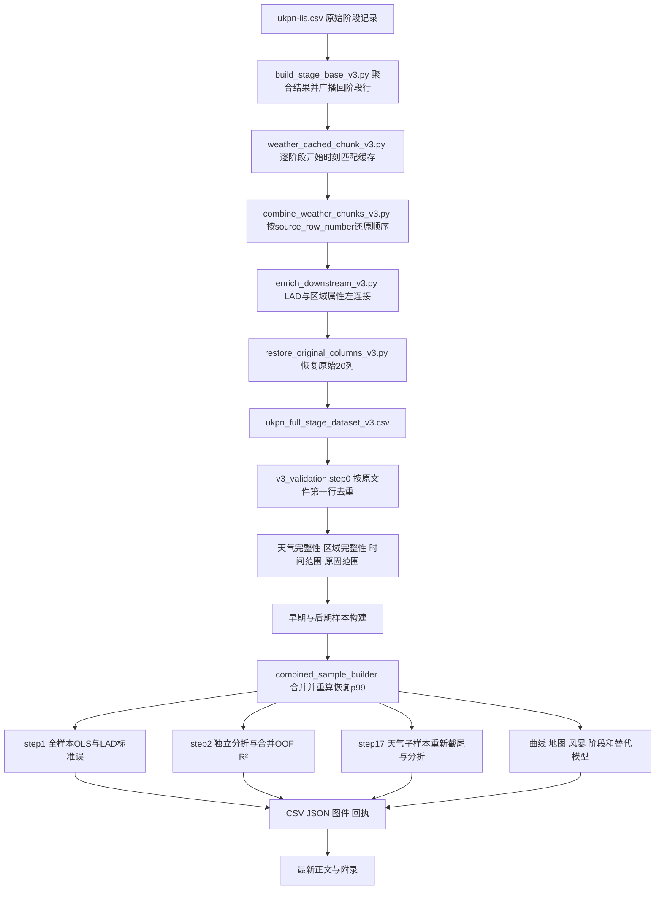

# 代码流程核查与研究推进脉络

日期：2026-09-05。对象：当前 `claude_branch` 研究分支、其只读依赖 `rebuild_v3_full_stage`，以及 `docs/0905new` 最新正文和附录。用户约束：不修改任何文稿，核实代码、数值和过程，后续按指令补充实验。

**本轮结论：现有核心数值可以复现，但代码所实现的研究过程存在需要优先处理的输入与评估口径问题。最重要的是事件代表行没有按开始时间选择，导致一部分“事发时天气”和日期实际取自后续阶段。不能以系数复现成功，推断这条证据链已经有效。**

本轮完成82个Python文件的语法、函数、文件引用和潜在写入点盘点；建立工作命令#1–#43的日志索引；人工追踪当前计算主干及关键辅助分析；从原始阶段数据核对聚合，并在隔离目录重建最终样本、重估四个全样本模型和核心折外预测。没有重新抓取天气、重做空间连接、运行全部历史探索模型或500次Bootstrap，也没有修复生产代码或更新论文图件。本报告不是“全部实验均已验证”的认证。

## 1. 研究推进过程与当前证据身份

| 阶段与历史命令 | 当时要解决的问题 | 代码或证据分支 | 对当前研究的意义 |
|---|---|---|---|
| 主线v6及分支初始化 | 原有log-OLS的样本内结果与样本外表现落差；事件和阶段定义不清 | 根目录框架说明、交接文档、早期审计 | 历史起点；不作为当前最终样本 |
| #1–#5 | 逐折系数稳定性；二维聚类；客户数与时长依赖；加入客户数及扩样本 | `borrowed_from_main`、`test1`、`test1b` | 聚类摸底未提供充分稳定的离散形态证据；这些分析使用旧结果变量或早期样本，不能直接替代v3上的证据 |
| #6–#8 | 回溯旧master管线，尝试重构，核对完整v3阶段表 | `pipeline_archaeology`、`pipeline_v2`、`v3_audit`；分支外v3重建 | v2是复制与试制路径；当前真正的数据入口是保留全部原始阶段行的v3，不是直接执行v2得到的最终文件 |
| #9–#10 | 用客户聚合值和两种时长重估；拆分变量定义与样本变化 | `v3_validation`、`v3_controlled_comparison` | 当前设计矩阵与很多样本构建函数从#9延续而来；#10对naive结果按时间取最早阶段，但天气仍继承#9样本，不能假定两者时间必然一致 |
| #11–#14 | 二次曲线最低点、原因范围及预测贡献 | `critical_wind_speed`、`cause_code_robustness`、`variance_decomposition` | 这些基础选择早于后来的时间分离，已经使用后期观察 |
| #15–#16 | 发现后期样本曾参与开发；重建早期样本 | `dev_sample_decontamination` | 更正样本归属；不能撤销先前的信息使用。早期暴露最低点变为12.13 m/s |
| #17–#18 | 客户数与恢复时长关系的非单调性及阶段组成 | `customers_duration_shape_investigation` | 描述性分层与加入阶段数的敏感性；不等于识别调度或因果机制 |
| #19–#20 | 后期单独拟合；回溯旧论文与地图定义 | `module_e_final_confirmation`、`old_paper_framework_review` | #19是在后期样本重新拟合，不是用早期训练模型预测后期；其贡献分解是后期样本内R² |
| #21–#24 | 合并样本最终模型、曲线和地图；命名风暴描述 | `final_combined_analysis` 的sample builder、step1/2/3/4/7/10/13 | 当前正文主要数值基线；合并样本重算恢复p99，不能简单相加两时期已截尾样本 |
| #25–#28 | 天气子样本、原因与风速分布、VIF/聚类/阶段检查；反事实迁移探索 | step17/21/30及相关回执 | 天气子样本贡献排序成为主问题；反事实迁移结果在历史记录中被放弃，不能恢复为当前正式支持证据 |
| #29–#32 | 数字总账、描述统计补齐、六原因组比较、来源回溯 | 数字总账、step36等 | 数字总账是有日期的汇总，不是永久权威；六组比较又有自己的p99和折分 |
| #33–#37 | 图件规范、替代分布和残差诊断、结果图制作 | figure系列、step40_model_form_check | 保存的绘图脚本仍有旧标签与旧区间；替代分布检查不等于检验二次函数形状的充分性 |
| #38–#43 | 数值口径、附录、三阶项、阶段交叉分箱、数学审查 | step38、step40_1/2、step42、step43及45–50号回执 | E0三阶项是不能忽略的已有反向证据；对称性解释被纠正；物理单位Bootstrap缺口被明确 |
| 0905最新稿 | 降低阈值、因果、独立验证等表述强度，形成T01–T14清单 | `docs/0905new` | 文本已前进，生产代码和图件生成规则尚未全部同步；清单不等于所有任务已获执行指令 |

逐条命令标题、原LOG行号及脚本提及见 [command_history_index.csv](D:/Pyprogramme/STST2603/claude_branch/results/code_audit_20260905/command_history_index.csv)。历史标题中的“最终”“独立”“确认”等词保留为原记录，不代表本轮认可。

## 2. 当前实际计算主干



关键实现如下。

- **结果变量**：客户数排除`Y/1`重复中断阶段后求和；空的有效客户集合得到缺失。duration_A是包含重复中断阶段的客户加权阶段时长；duration_B是所有阶段最晚结束减最早开始。当前模型用B，不能误读兼容列`Duration (hours)`，后者在v3仍对应A。
- **天气**：v3缓存工人按每条阶段行的开始时间工作；坐标四舍五入到0.1度用于请求键。小时取floor；窗口为`(t−24h,t]`，包含事件所用整点。代码请求`wind_gusts_10m`、`wind_speed_unit=ms`、`timezone=GMT`，没有显式指定`models`。缓存与实际气象产品的来源还需单独核实。
- **区域**：LAD以事件坐标空间连接；人口按LAD与年份合并；IMD与GVA通过旧主线已存在的结果表建立静态lookup。因此“独立重构事件结果”不意味着所有外部属性均独立重建。
- **样本**：`drop_duplicates(Incident Reference)`在天气筛选前执行；开发样本按保留行日期 `<2023-09-30`，后期为`2023-09-30`至`2024-03-31`；完整预测器筛选后保留天气/资产两组。
- **模型**：E0为`log1p(C)`，R0c为`log(D)`并加入标准化`log1p(C)`及平方。天气四列标准化，平方和交互随后构造。区域变量保留原数值尺度（人口先取log），并非所有连续变量均标准化。年份和月份是两套加性哑变量；均值模型没有LAD固定效应。
- **推断与评价**：全样本系数用LAD聚类协方差及正态近似p值；日期GroupKFold中标准化使用训练折。贡献分解先拼接OOF预测再统一评分。训练折系数的稳定性、样本内拟合、OOF评分和后期重新拟合是不同证据。
- **输出链**：许多下游脚本会重新构建样本、重新拟合，而不是读取冻结模型；读取函数有写入副作用，输出常使用固定路径。缺少统一不可变的运行清单与模型对象存档。

## 3. 本轮实际复现结果

### 3.1 源数据与阶段聚合

读取原始237,901行、20列，与v3中的同名源字段逐列对照，全部值和行顺序一致。v3有135,025个唯一事件。其SHA256仍为README记录的`0aad744eabd2e86f186cdb6072964fcea4492afaf34b8deaa94c51ce553dd16f`。

本轮从原始字段重新计算全部事件的C、A、B，并比较广播到237,901行的值：C完全一致；A/B只有约10⁻¹³小时浮点误差，容差内不一致行均为0。**这验证了代码实现与已选聚合公式的一致性；未验证这些字段的官方业务语义或特殊停钟规则。**

### 3.2 样本流

| 处理层级 | 本轮复现数量 |
|---|---:|
| 原始阶段行 / 唯一事件 | 237,901 / 135,025 |
| 取代表行后天气matched的事件 | 121,313 |
| 完整预测器、截止研究终点 | 117,298 |
| 天气与资产两组基础分析事件 | 60,453 |
| E0 / R0c | 60,437 / 59,834 |
| 天气E0 / 天气R0c | 9,857 / 9,758 |
| 开发E0 / 开发R0c | 48,323 / 47,840 |
| 后期E0 / 后期R0c | 12,114 / 11,992 |

开发、后期、合并主样本、天气子样本各自恢复p99为194.795833、167.365333、192.083333、142.844667小时。分别截尾的两时段恢复样本相加为59,832；合并后重算p99得到59,834，这2条差异可由实现解释。

### 3.3 模型与评分

主样本E0的26个系数和R0c的28个系数，以及各自LAD标准误，与存档最大绝对差均小于`1.2e-16`。矩阵秩分别为26和28，均满秩。现有模型输入中的gap并非income deprivation rate加减一个常数：拟合仿射关系后残差最大绝对值约0.161。这排除了这两个实际列精确共线的猜测，但未完成gap原始定义溯源。

四组样本共16个嵌套模型配置、80次折内拟合已完成；各配置OOF预测和逐折R²均保存。14个可直接对应历史序列表的汇总值与存档最大差小于`3e-16`。主样本内R²为0.032302453和0.117606171；以下是完整模型的两种OOF评分。

| 样本 | 合并OOF R²，代码实际使用 | 五折R²简单平均 | 差异，百分点 |
|---|---:|---:|---:|
| 主E0 | 0.028123975 | 0.027770739 | 0.0353 |
| 主R0c | 0.110536591 | 0.107366738 | 0.3170 |
| 天气E0 | 0.020103347 | 0.018292917 | 0.1810 |
| 天气R0c | 0.215581756 | 0.161713733 | 5.3868 |

这不是要求改用另一指标；首先需要使研究定义、代码和报告一致。天气R0c差异较大，不能把两种指标当作相同数值的不同名称。

## 4. 需保留的代码核查发现

### C01 事件代表行与最早开始时间不一致 最高优先级

**已确认实现及数据影响。** [v3_validation_pipeline.py第64行](D:/Pyprogramme/STST2603/claude_branch/scripts/v3_validation/v3_validation_pipeline.py:64)直接按原行序去重；上游合并又特意恢复原行序。天气工人为每条阶段自己的开始时刻提供天气，所以下游选中哪一行，会选中哪一阶段的天气与日期。

| 样本 | 所选开始时间晚于最早记录开始 | 天气小时不同 | 日期不同 | 可比较的阵风值不同 | 阵风差超过1 m/s |
|---|---:|---:|---:|---:|---:|
| 主E0，60,437 | 8,199（13.57%） | 7,810 | 2,225 | 7,644 | 5,107 |
| 主R0c，59,834 | 8,113（13.56%） | 7,724 | 2,161 | 7,560 | 5,044 |
| 天气E0，9,857 | 1,074（10.90%） | 965 | 255 | 945 | 675 |
| 天气R0c，9,758 | 1,060（10.86%） | 951 | 243 | 931 | 663 |

主E0发生开始时间差异的事件中，延迟中位数5小时；最大4,506.37小时，需作为特殊事件另查，不能默认其跨度有效。主R0c对应最大172.70小时。主E0有1条最早阶段无可用阵风，其余60,436条可比较；阵风最大绝对差约24.8 m/s。主E0/R0c均有1个事件按最早开始日会改变早期/后期归属。

本轮未发现这些样本中所选行与最早行的坐标/LAD不同，但这不消除时间问题。这里的“最早”是原始记录的最早开始时间，不等于已经通过业务字典证明的真实故障onset。

**影响范围**：阵风及其他天气、24小时降水窗口、年月、日期CV、时段划分、风暴归属，以及依赖这些输入的全部模型和图。客户聚合与B跨度本身没有因这次选行而改变。后续应先明确事件onset和同刻并列行规则，形成一版事件代表记录，再决定统一重估；不要在现有输入上直接堆叠补充敏感性。

### C02 主要R²文字定义与实现不一致

**已确认并量化。** 最新正文§3.2及相关图注称平均折R²；[variance_decomposition_pipeline.py第198行](D:/Pyprogramme/STST2603/claude_branch/scripts/variance_decomposition/variance_decomposition_pipeline.py:198)使用全体目标的总离差作为分母，后续用全部OOF残差平方和评分。第3.3节已给具体差值。三阶项脚本同样使用合并OOF R²。

同一样本、相同折内的各嵌套模型确实配对评价。对完整模型分别去掉gust组或customers组，可从已保存结果重新构造点估计差；本轮未新增其统计置信区间，也不把五个重叠训练折当五次独立实验。

### C03 天气子样本比较同时改变尾部与折分

**已确认并量化。** [step17_weather_natural_subsample.py第86行](D:/Pyprogramme/STST2603/claude_branch/scripts/final_combined_analysis/step17_weather_natural_subsample.py:86)单独计算天气样本p99。主R0c中有9,806个天气事件，天气R0c只有9,758个；额外删除48个。天气截止142.844667小时，主样本为192.083333小时。

该脚本第118–119行重新GroupKFold；本轮对共享日期的折分列联表验证，主/天气样本的划分并不相同，即使允许重命名折号也无法对应。两个主模型之间也各自分折。表4是这些既定设置下可复现的点估计，不是仅更换原因人群而保持其余条件完全一致的比较。

### C04 风暴暴露图与评价多加了一次log1p

**已确认并量化。** [step13_storm_prediction_check.py第80行](D:/Pyprogramme/STST2603/claude_branch/scripts/final_combined_analysis/step13_storm_prediction_check.py:80)先计算`pred=exp(η)`；第124行计算`log1p(pred)`。`figure9_storm_validation.py`复用了相同路径。模型目标是`log1p(C)`，其直接拟合值为η；现有纵轴却是`log(1+exp(η))`，始终高于η。

用存档系数确定性复算，完整E0的相关系数由原路径0.179335982变为η路径0.179728832；log尺度MAE由1.717499382变为1.690321118，平均额外纵向位移为0.116592479。各风暴对照已保存。相关系数改变较小，不代表图的尺度标注和MAE计算正确。此处修正不涉及是否采用smearing，也不证明模型已经校准。

### C05 风暴恢复评价样本包含训练时删除的长时事件

**已确认。** [step13_storm_prediction_check.py第132行](D:/Pyprogramme/STST2603/claude_branch/scripts/final_combined_analysis/step13_storm_prediction_check.py:132)从未截尾的基础风暴事件取`D>0,C非缺失`，没有再限制为R0c拟合样本。七个风暴分别有1、2、22、9、3、5、7条评价记录不在恢复拟合样本中；这些数量按风暴窗口分别计数，窗口重叠时不能直接相加为独立事件数。

因此图9恢复侧是“大部分训练内事件加部分尾部未参与拟合事件”的混合。不能称所有画出的点均参与训练；也不能据此称它为独立风暴留出。全样本恢复基准却在截尾样本上算，和各风暴评价总体不同。原风暴窗口在2月17日和19日重叠；七个名字不代表七份独立数据。

### C06 标准化范围与“全部连续预测器”不一致

**已确认代码口径。** [v3_validation_pipeline.py第195行](D:/Pyprogramme/STST2603/claude_branch/scripts/v3_validation/v3_validation_pipeline.py:195)只标准化天气四列及R0c额外客户列；income deprivation、gap、Moran’s I、log population未标准化。本文主模型数值能按这一口径完全复现。最新稿§3.3“Continuous predictors are standardised”概括过宽；不能据它把全部系数当成可直接比较的单位标准差效应。

### C07 曲线与地图的参考条件并不完全相同

**已确认并量化。** [step3_dose_response_curve.py第76行](D:/Pyprogramme/STST2603/claude_branch/scripts/final_combined_analysis/step3_dose_response_curve.py:76)对非阵风设计矩阵列取均值。因此R0c客户一次项约0，但客户平方项为0.999983287，而非0。地图代码则把这两项都显式设为0。

曲线可以解释为对部分设计列平均后的log响应，但不能同时称为“一个客户标准化值等于0的具体事件”：该点的平方必须也为0。仅这一参考差异使曲线水平相对客户z=0情景乘以约0.672957。它不改变同一阵风曲线的max/min比或最低点位置，但影响绝对水平及不同图的场景一致性。

### C08 修订后的Bootstrap和图件规则尚未回写到生成脚本

**已确认代码，部分已被最新文字识别。** 原Bootstrap每次重估尺度，却先汇总z最低点，再用原样本gust尺度反算区间。#43补存gust尺度和自身均值气压下的物理值，但仍没保存每次gust×pressure系数和pressure均值/SD，不能完整恢复固定物理气压参照的区间。

`figure4_dose_response.py`仍硬编码旧9.20–12.06区间及“critical wind speed”；`figure10_robustness_forest.py`仍为重叠CV系数的逆方差汇总绘制名义区间。最新正文已撤回这些做法；原样重新运行脚本将再生成旧版本。本轮未修改脚本，也未声称检查了Word内所有图片的实际像素内容。

### C09 可复现性上的文件与运行环境缺口

- `step0_build_sample`、LAD检查、折分函数会覆盖`results/v3_validation/raw/step0/1/2`相关文件；被#16/#19/#21调用时仍有此副作用。函数名看似“build/read”，并不意味着只读。
- v3主天气脚本在导入时创建指向根目录缓存的`CachedSession`；一些v2与早期脚本保留主线或Linux沙箱写入路径。不能直接批量执行全部脚本来“验算”。
- 原`.venv`指向不存在或无法启动的旧Python路径。本轮使用捆绑CPython3.12.14，加载现存项目库，并启用`-B`避免写入pycache。环境版本和命令已保存，未重装或修改环境。
- 在本轮盘点的分支与v3 Python文件中，未找到生成最终`step26_*_vif.csv`、`step27`阶段收尾结果、`step28`聚类系数表的独立生产脚本；发现了输出及消费者。可能源自当时临时命令，不能据此认定从未计算；但当前链路缺少可直接重跑的生产者。
- VIF原报告明确未把年月哑变量纳入辅助回归，所以其“全部VIF<4”不能直接扩展为完整设计矩阵所有列的诊断。本轮只验证矩阵满秩与gap不精确共线，未重做完整VIF专题。
- `results`下91组同名Markdown报告在所查副本间SHA256一致；`code9#`、`21#`等目录不是独立验证证据，也不应仅凭目录标签优先于实际来源。

## 5. 尚未验证的部分与后续依赖

### 输入与工程语义

原始时区、API缓存实际模型来源、阵风统计窗口、原因代码官方释义、零客户业务含义、停钟/视同恢复等，不能只靠当前程序判断。窗口代码没有使用`t`之后的小时行，但当`t`取自后续阶段时，它也不再是对事件最早开始时刻的回看。主样本中所有已选24小时窗口都含24行、天气小时均与已选行floor一致；这说明程序忠实匹配了已选阶段，不是证明选对了事件onset。

### 其余科学实验

本轮未重做聚类/独立性探索、全部逐折历史系数、GLM四套估计、500次Bootstrap、六组敏感性或空间连接全链。已有负向结果和局限保留。缺首阶段在本轮主E0为8,817/60,437，主R0c为8,671/59,834；天气样本相应为2,593/9,857和2,578/9,758。不能把全135,025事件的10.56%直接沿用为当前各模型比例。

### 建议依赖顺序

1. **先处理C01事件代表记录与时间基准**：明确onset、同刻并列行、原因冲突、跨年和跨边界事件的规则；同时查明T01–T03的源字段语义。保留现有数值为历史基线。
2. 再冻结分析样本与全局日期/天气过程分块，将C03尾部规则和比较总体写入实验配置。
3. 然后重跑主模型及必要的形状、尾部、贡献比较；同时输出合并OOF、逐块损失和完整预测记录，避免在不同口径之间拼接数字。
4. 依据结果决定最低点地位与Bootstrap投入；补齐缺失的生产脚本和运行记录。
5. 最后向作者提供结果与逻辑影响报告。文稿仍由作者或另一个明确授权的流程修改。

这些是本轮代码核查所揭示的依赖，不是已经执行的修复或新的全部实验授权。

## 6. 交付文件与复现边界

本轮新增文件全部位于`claude_branch/scripts/code_audit_20260905`和`claude_branch/results/code_audit_20260905`。

| 文件 | 用途 |
|---|---|
| `script_inventory.json/.csv` | 82个原有Python文件的哈希、语法、函数、引用及潜在写入点；AST盘点不等于逐行语义审查 |
| `command_history_index.csv` | #1–#43完整历史索引 |
| `source_and_sample_checks.json` | 源字段、全量聚合、样本流与哈希 |
| `full_fit_summary.csv`、四份`*_full_coefficients.csv` | 四组现有样本完整拟合、矩阵秩与参考尺度 |
| `coefficient_archive_comparison.json`、`oof_archive_comparison.csv` | 对历史存档的精确差值 |
| `oof_metric_comparison.csv`、`per_fold_r2.csv` | 两种R²口径和逐折结果 |
| 四组`*_sample_membership.csv`、`*_folds.csv`、`*_oof_predictions.csv` | 明确事件成员、折号及所有嵌套模型预测 |
| `representative_row_summary.csv`、四组`*_representative_row_audit.csv` | 当前代表行与最早记录的事件级对照 |
| `storm_exposure_scale_audit.csv`、`storm_recovery_membership_audit.csv` | 风暴尺度与训练/评价成员检查 |
| `curve_reference_audit.json`、`fold_alignment.json` | 参考情景与跨样本分折差异 |
| `runtime.json`、`historical_preservation_check*.json` | 实际运行环境与原文件保护检查 |

运行方式：

```powershell
& 'C:\Users\haoya\.cache\codex-runtimes\codex-primary-runtime\dependencies\python\python.exe' -B scripts/code_audit_20260905/audit_pipeline.py
& 'C:\Users\haoya\.cache\codex-runtimes\codex-primary-runtime\dependencies\python\python.exe' -B scripts/code_audit_20260905/trace_findings.py
```

第一份脚本独立实现样本选择和结果聚合；设计矩阵只通过AST提取已检查的`design_train_valid`函数，不导入其有副作用的整个模块。故复现结果是“当前样本规则+既有矩阵实现”的核验，不是模型设定的独立科学验证。第二份脚本用存档系数确定性重算图表量并追查代表行，没有修正onset后重新拟合模型。

执行前后监测的549份现有相关小于5 MB文件均未改变；原始大CSV仅只读打开，另记哈希。论文、原生产代码、既有结果和LOG未修改。覆盖回顾：主干依赖与历史推进已建立，核心数值复现完成；输入时间基准、源字段语义、图表生成一致性及部分生产者缺口仍为未解决项。
